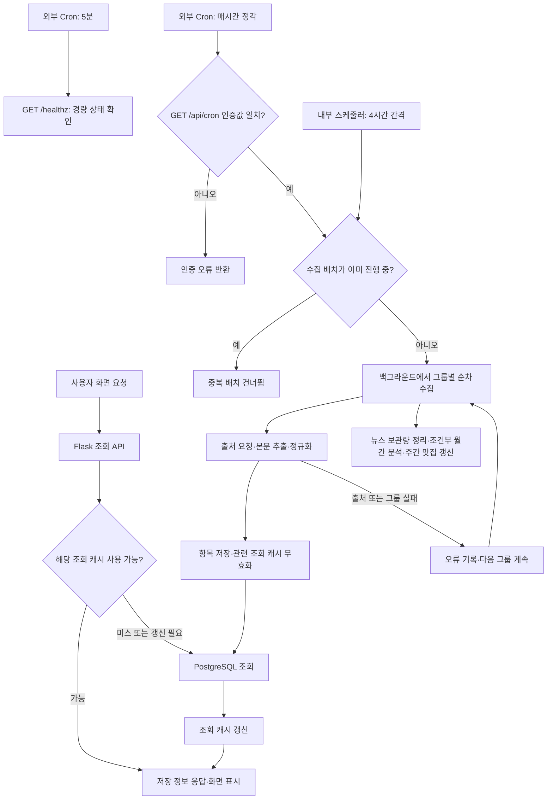
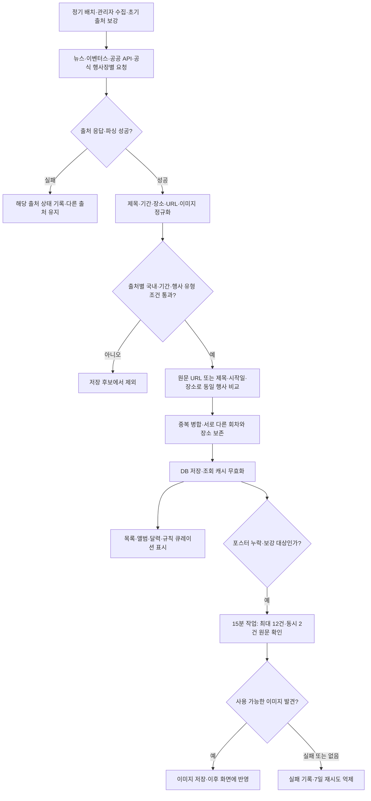
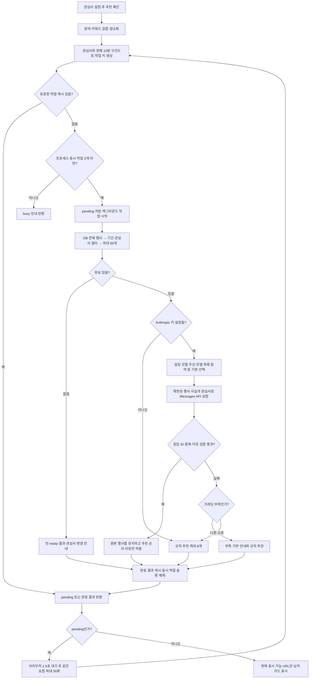
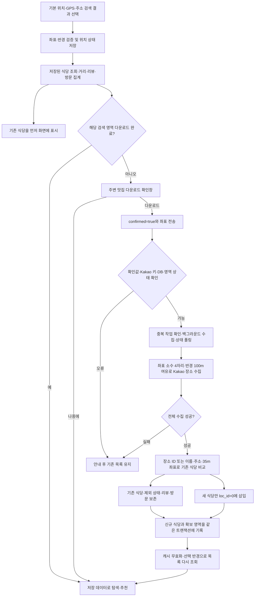
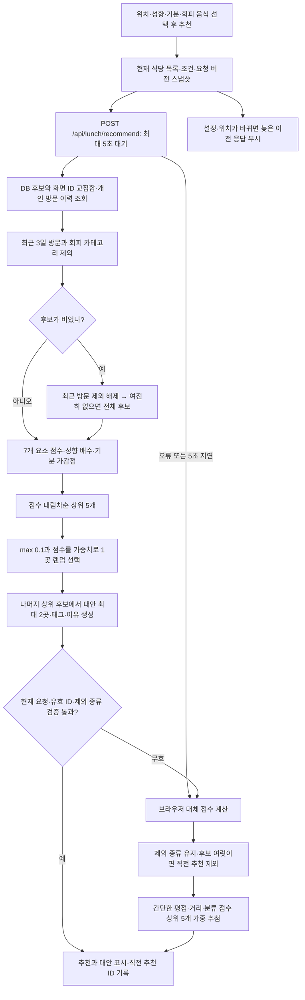
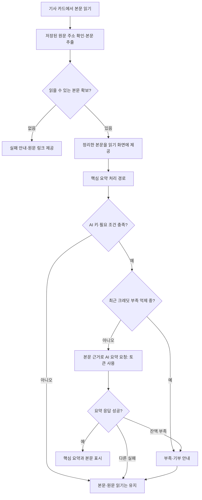

# 개발자노트 — 휴 스코프

현재 기준: **v3.142 · build 261010 · 2026-10-10**

휴 스코프는 김상화가 생활과 업무에 필요한 정보를 모아 쓰기 위해 제작·개선하는 개인 서비스다. 이 문서는 **현재 구현된 기능과 운영 방식**을 설명한다. 변경 당시의 내용과 적용 순서는 `CHANGELOG.md`에 보존한다.

### 크레딧 부족 안내 (v3.142)

- 기사 요약·행사 추천·AI 리포트의 크레딧 부족 안내에 운영자용 Claude Console 결제 링크를 표시합니다. 계좌번호는 원문 그대로 보관하며 안내 영역에서 iOS 자동 번호 인식 링크의 밑줄을 제거합니다.
- 결제 링크는 새 창에서 해당 Console 계정으로 로그인하여 사용합니다. 후원하기 및 AQR 은행 앱 연결은 개인계좌 링크 확인 후 추가할 예정이며 현재는 제공하지 않습니다.

### 백그라운드 부하 제어 (v3.140)

- 단일 웹 워커에서 수집·초기 출처 보강·주간 맛집 재수집·이미지 보강·전수 점검은 공유 슬롯 하나를 사용합니다. 일반 조회는 이 슬롯을 기다리지 않습니다. 중첩 작업은 같은 슬롯을 재사용하고 점검은 대기열에서 우선 처리합니다.
- 정기 이미지 보강은 슬롯 사용 중이면 다음 주기에 재시도합니다. 동향은 10분·행사는 15분 주기입니다. 살아 있는 수집 스레드는 30분이 지나도 중복 시작하지 않습니다.
- 뉴스 원문/요약 동시 처리를 최대 2건으로 제한합니다. HTTP 요청은 스트리밍으로 해제 후 최대 4MiB까지 보관하며 초과 응답은 오류로 처리합니다. 정상 UTF-8에는 문자 인코딩 추정을 생략하고 레거시 추정은 64KiB 표본만 사용합니다. 기사·RSS 파싱 객체는 명시적으로 해제하며 작업 종료 시 GC와 지원되는 Linux 메모리 반환을 수행합니다.
- 전수 점검은 수집 종료를 최대 15분 기다립니다. 대기 상태·경과 시간도 저장하며 총 소요 시간에 포함합니다. 대기 초과는 미완료이며 정상이나 서비스 장애로 확정하지 않습니다.
- 격리 Python 모듈만 Linux 데이터 메모리 256MiB 제한을 적용합니다. JavaScript 힙은 96MiB입니다. 제한 초과·강제 종료는 검사 환경 오류로 표시합니다. 웹 프로세스의 메모리 제한을 변경하지 않습니다.

### 자동 기능 점검 (v3.139)

- 매일 한국 시간 03:00 Render 예약 작업이 서명된 요청으로 서비스 점검을 시작합니다. 무료 웹 서버의 휴면 상태에서도 요청으로 깨운 후 실행 상태를 추적합니다.
- 관리자 도구 → 기능 점검에서 수동 실행, 최근 30회 기록, 정상 항목 숨기기, 결과 새로고침을 제공합니다.
- 서비스 점검 실패와 테스트 검증 실패·실행 예외·환경 오류, 점검 도구 오류를 별도 집계합니다. 테스트 실패만으로 서비스 장애를 확정하지 않으며 미점검은 정상으로 판정하지 않습니다. 기존 기록은 원본 상태·시간을 보존한 채 분류하여 표시합니다.
- DB에 시작·종료 시각, 전체 소요 시간, 항목별 소요 시간, 상태와 진행 정보를 보관합니다. 실행 중 경과 시간은 1초마다 표시합니다.
- 운영 조회·외부 연결과 격리 환경의 전체 등록 Python·JavaScript 테스트를 검사합니다. 실제 사용자 데이터의 삭제·전체 재수집·AI 생성은 하지 않습니다. 실기 GPS/AirPlay와 모든 영상의 전수 재생은 자동 검사의 보장 범위가 아닙니다.
- 크론 서명용 공개키만 코드에 포함합니다. 개인키는 예약 서비스 환경변수에만 보관합니다. 중복 실행·같은 날짜의 중복 자동 실행을 DB 잠금으로 막습니다.

### 은행 거래 환율 (v3.135)

- 출처: 하나은행 공식 [현재환율](https://www.kebhana.com/cont/mall/mall15/mall1501/index.jsp). 공식 조회 화면의 공개 요청 [주소](https://www.kebhana.com/cms/rate/wpfxd651_01i_01.do)에 조회일·현재회차(`pbldDvCd=3`)를 POST합니다. 로그인·API 키를 사용하지 않습니다. 공개 화면의 스크립트에서 요청 주소와 필드를 확인했습니다.
- `/api/finance/exchange`는 별도 비동기 조회와 300초 캐시를 사용합니다. USD·JPY·EUR·CNY 고시값을 카드에 추가하며 JPY는 100엔, 나머지는 1단위 기준입니다. 고시 일시·회차를 ECOS 관측 기준일과 분리합니다.
- 표의 11개 열에서 현찰 살 때(1)·팔 때(3)·송금 보낼 때(5)·받을 때(6)를 사용합니다. 스프레드율·외화수표 가격은 제외합니다. 헤더 구조·고시 일시·엔화 100단위·양수 유한값·매수/매도 순서를 검증합니다.
- 고객 기준·우대 적용 전 고시값입니다. 미제공·파싱 실패·네트워크 실패는 숫자를 비우고 상태를 표시합니다. 임의 계산·다른 은행 값·ECOS 값으로 대체하지 않습니다.

### 로그인 응답·개인 데이터 (v3.133)

- 로그인 성공 화면은 `/api/login` 완료 시 즉시 전환합니다. `/api/mydata`는 별도로 조회하며 계정 세대별로 중복 요청을 합칩니다. 오래된 개인 데이터 및 초기 `/api/me` 응답은 계정 전환 후 적용하지 않습니다.
- 스크랩 조회 중에는 스켈레톤, 실패하면 재시도를 제공합니다. 데이터 준비 전 변경은 조회 성공 후 실행하고 계정이 변경됐으면 취소합니다. 개인 데이터 실패가 인증 실패로 보이지 않도록 별도 안내합니다.
- `_prewarm_reads()`에서 기존 DB 준비 후 `accounts.init_store()`를 워커별로 미리 호출합니다. 인증·세션 검증 결과를 캐시하거나 생략하지 않습니다.

### 알림 문구 표시 (v3.132)

- `toast()`는 UI 안내에만 `uiNoticeText()`를 적용해 문장 단위로 나누고 `textContent`로 안전하게 표시합니다. 로그인은 이름과 완료 문장을 명시적으로 분리합니다. 원문 기사·URL·숫자에는 줄바꿈 변환을 적용하지 않습니다.
- `.toast`는 `white-space:pre-line`, `word-break:keep-all`, `overflow-wrap:anywhere`로 모바일 폭과 긴 이름에 대응합니다. 2줄 이상은 최소 3.5초, 긴 문구는 최대 6.5초 표시합니다. 상태 안내는 `role=status`, `aria-live=polite`로 알립니다.

### 재무세무 데이터 표시 (v3.131)

- ECOS 키 미설정은 `unconfigured`, 최초 대기 응답은 `loading`으로 반환하며 값·변동·기준일·추이를 비웁니다. 예시값을 실제 지표 대신 사용하지 않습니다. 프론트에서도 과거 `demo` 응답의 숫자와 추이를 차단합니다. 대기 화면은 스켈레톤을 사용합니다.
- 재무세무 beta 표시는 탭·화면·표시 설정·소개 문구에서 제거했습니다.

### 스켈레톤 로딩 UI (v3.130)

- 공통: `static/js/skeleton.js`의 `HScopeSkeleton.html/render`, `static/css/skeleton.css`. 서버 최초 뉴스는 `templates/skeleton_initial.html`로 즉시 렌더링합니다.
- 목록·식당·행사·영상 포스터·경제지표·리더·리포트별 형태를 사용합니다. 별도 이미지/API/타이머를 추가하지 않고 기존 요청 완료 시 실제 데이터 또는 빈/오류 안내로 치환합니다.
- 새로고침 시 표시된 카드가 있으면 유지합니다. 리더의 요청 순서·취소 검사를 유지하며 실패 시 현재 요청의 스켈레톤만 제거합니다. 재무 조회의 폴링 종료·오류에서도 대기 UI를 제거합니다.
- 읽기 보조기기에 로딩 상태를 알리고 장식은 숨깁니다. `prefers-reduced-motion`을 존중합니다. 서버가 잠든 Render 플랫폼 대기 화면에는 서비스 CSS를 적용할 수 없습니다.

### 계정 관리 운영 (2026-10-08)

- 관리자 도구의 계정 관리에서 일반 계정 목록·추가·표시 이름/비밀번호 수정·삭제를 제공합니다. 관리자 계정은 목록에서 잠금 표시하고 API에서도 수정·삭제를 거부합니다. 관리자 비밀번호는 기존 환경변수 방식으로 유지합니다.
- 일반 계정은 `app_account` 테이블에 아이디·표시 이름·비밀번호 해시·세션 버전·삭제 상태를 저장합니다. 비밀번호/해시는 목록 API에 반환하지 않습니다. `POST /api/admin/accounts`, `PATCH/DELETE /api/admin/accounts/<username>`은 관리자만 사용할 수 있습니다.
- 기존 test1(별칭 tester1)을 최초 1회 해시 계정으로 이관합니다. 삭제 후 배포·재시작해도 다시 생성하지 않습니다. 아이디는 개인 자료의 연결 키이므로 변경·재사용하지 않습니다.
- 삭제는 로그인 차단 및 목록 제외로 처리하며 스크랩·읽음·후기 등 기존 자료는 보존합니다. 계정 수정/삭제는 세션 버전을 갱신하고, 일반 계정 API 요청 시 유효성을 검사합니다.
- 추가/변경 비밀번호는 8~128자이며 수정 화면에서 비워두면 기존 비밀번호를 유지합니다. 일반 계정에 관리자 권한을 부여하는 입력은 거부합니다.

### 표시 설정 운영 (2026-10-08)

- 표시 설정은 주요 메뉴(맛집·영상·재무세무·AI 리포트·스크랩), 뉴스 세부 탭, 동향 통합 소스(재단 게시판·소셜 영상)를 구분합니다. 뉴스/냥정보는 기본 진입점입니다.
- `/api/features`는 DB의 `feature_flags`를 부분 갱신합니다. 기존 값을 유지하며 새 키 `food`, `videos`, `finance`는 저장값이 없으면 기본 True입니다.
- 숨김은 방문자·일반 사용자 화면에 적용하며 관리자는 전체를 확인할 수 있습니다. API 접근 권한을 변경하는 기능은 아닙니다.
- 동향 게시판/소셜 숨김은 필터와 통합 목록에 적용합니다. 숨겨진 활성 메뉴는 뉴스로 복귀하고, 저장 중 설정 조작을 잠가 응답 순서 충돌을 방지합니다.

### 마우스 드래그 스크롤 수정 (2026-10-08 오후)

- 기존 텍스트 선택이 남아 있으면 드래그를 건너뛰던 문제를 수정했습니다. 좌클릭을 유지한 채 끌면 화면이 움직이며 Shift 드래그로 텍스트를 선택합니다.
- 버튼·링크·분류 라벨 위에서도 드래그를 시작할 수 있고, 6px 미만 움직임은 기존 클릭을 유지합니다. 드래그 뒤 발생하는 클릭은 차단합니다.
- 처음 이동이 가로 방향으로 흔들려도 세로 스크롤을 취소하지 않습니다. 스크롤 가능한 곳은 펼친 손, 누르는 동안은 잡은 손 커서로 표시합니다.
- 입력 필드·영상·슬라이더·모바일 터치는 유지합니다. 팝업 내부 스크롤과 배경 잠금도 유지합니다.

## 1. 문서 기준과 최근 변경

- **v3.129**: 런처에 [기능명세서·IA 표](https://hscope.onrender.com/static/docs/function-spec.html)를 추가했다. 화면별 탑·바디·푸터·팝업, 버튼·입력·선택·표시 상태·동적 기능을 Depth 1~5로 정리하고 동작·조건·결과·예외·권한·저장·근거를 기재했다. 검색/화면/영역/권한 필터, Markdown 표 원문 다운로드, 인쇄/PDF 저장을 지원한다. 생성 근거는 `scripts/build_function_spec.py`와 `static/docs/function-spec-coverage.json`에 보관한다.

- **v3.128**: 관리자 화면의 개발자 노트 탭·본문 제공을 제거하고, 런처에서 [GitHub 개발자 노트 원문](https://github.com/kksh0379/ncfoundation-collector/blob/claude/quirky-euler-agfmp/DEVNOTE.md)으로 직접 연결한다. 관리자는 패치내역만 조회한다. 맛집 점수·성향·조건 완화·대체 추천, 행사 후보 생성·AI 호출·검증·캐시·오류 처리를 코드와 대조하고 6개 상세 프로세스 도식을 정리했다.

**읽는 순서**: 운영 연결은 2.1~2.7, 행사 수집과 AI 추천은 6절, 맛집 다운로드와 추천 점수는 7절에서 확인한다. 도식은 각 흐름의 입력·분기·저장·응답·실패 처리를 나타낸다. 아래 수치와 제한은 문서 작성 시점의 구현값이며 추천 품질 보장이나 외부 제공자 정책을 뜻하지 않는다.

- v3.127: 운영 인프라, 외부 API, 직접 수집 사이트, 검색 기반 원문, 공유·영상·표시 라이브러리의 연동 주소·용도·설정을 아래 목록으로 정리. 개발노트 화면에서 링크 클릭과 표 표시를 지원한다. 10월 8일 추가한 외부 5분 유지 호출도 운영 구성에 반영했다.

- v3.126: 공통 고양이 로딩의 첫 정지 장면을 코드에 포함해 즉시 표시하고 애니메이션을 우선 요청. 배경 점선 원을 CSS 캣휠로 변경. 이미지 실패 시에도 첫 장면을 유지하며 동작 줄이기 설정을 존중한다.

- v3.125: 행사 탭과 AI 추천받기의 높이를 36px로 통일하고 추천 버튼을 행 오른쪽 끝에 정렬.

- 현재 운영 코드와 v3.71~v3.121의 적용 이력을 대조하여 기능·운영 설명을 갱신했다. v3.122는 문서 정비와 패치내역 표시 수정이며, v3.123은 기존 NC뉴스 마크 복구다.
- 패치내역은 날짜 아래 버전을 최신순으로 나열하고, 각 버전을 펼치면 당시 변경 상세를 표시한다. 이후 교체·제거된 기능도 당시 이력으로 보존하며 현재 동작은 이 문서에 설명한다.
- v3.59~v3.64는 이전 이력 정비 때 커밋 순서로 복원한 번호다. 당시 화면에 각각 표시된 버전이라는 의미는 아니다.
- 최근 변경은 영상 기능(v3.75~v3.103), 서비스 런처·기획서(v3.104~v3.108), 뉴스·행사 수집(v3.109~v3.111), AI 크레딧·공유(v3.112~v3.114), 설치·앱 화면(v3.115~v3.121)이다.

## 2. 서비스 구성과 배포

- **웹 서버**: Python Flask + Gunicorn. 화면·조회 API·수집 작업·분석 작업을 같은 앱에서 제공한다.
- **호스팅**: Render의 hscope 웹 서비스. GitHub 운영 브랜치 변경을 자동 배포한다. 커밋 반영과 운영 응답 확인을 구분한다.
- **영구 저장소**: `DATABASE_URL`이 설정되면 외부 PostgreSQL을 사용한다. 미설정 시 SQLite로 동작하며 Render의 임시 파일시스템에서는 재배포 후 보존을 보장하지 않는다.
- **외부 연동**: Google News RSS, 기관 게시판 API, YouTube Data API, 이벤터스 공개 검색 API, 행사 공공 API·공식 일정 페이지, Kakao Local, Anthropic, ECOS, Open DART, 국세청 사업자 상태조회.
- **개발 도구**: GitHub·Render MCP는 코드 확인·반영·배포 운영을 돕는 개발 도구다. 서비스 이용자의 요청을 처리하는 런타임 API와 구분한다.
- **서비스 런처**: https://hscope.onrender.com/
- **휴스코프 주소**: https://hscope.onrender.com/hscope
- **소개 페이지**: https://hscope.onrender.com/intro
- **저장소**: https://github.com/kksh0379/ncfoundation-collector
- **서체**: KoddiUD 온고딕을 직접 호스팅한다. 소개 페이지에 한국장애인개발원·CC BY-SA 출처를 표시한다.

### 조회·수집·운영 프로세스

화면 조회는 저장된 정보를 우선 사용하고, 모든 조회가 외부 수집이나 AI 요청을 동반하지 않는다. 공개 조회 캐시·위치 캐시 등은 서버 프로세스 메모리에 있으며 재시작하면 사라진다. PostgreSQL 데이터와 구분한다. 조회별 TTL과 실패 시 동작은 해당 API의 구현을 기준으로 한다.

`/api/cron`의 성공은 **배치 시작 요청이 접수됐다는 뜻**이다. 모든 출처의 성공을 보장하지 않는다. `_batch_all`은 최근 1시간 내 진행 중인 배치를 건너뛰고 그룹을 순차 처리하며, 그룹 실패 뒤 나머지 수집을 계속한다. 5분 `/healthz` 호출은 수집·AI 분석을 수행하지 않는다. Render 서비스 깨우기 실패의 원인·응답과 앱 수집 오류를 구분한다.

내부 스케줄러는 `ENABLE_SCHEDULER` 설정을 따르며 행사 이미지 보강 5분, 비즈니스 이미지 보강 2분 작업도 별도 등록한다. 프로세스 시작 시 출처 초기 수집·누락 이미지 보강 등은 별도 백그라운드 작업으로 실행한다. 배치·캐시·잠금은 프로세스 범위이므로 현재 Gunicorn 1 worker 설정과 함께 이해해야 한다.

코드: [배치·스케줄러·API](https://github.com/kksh0379/ncfoundation-collector/blob/claude/quirky-euler-agfmp/app.py) · [DB](https://github.com/kksh0379/ncfoundation-collector/blob/claude/quirky-euler-agfmp/collector/db.py).

### 2.1 운영 인프라·저장소·배포 연결

**확인 기준: 2026-10-08 KST.** Render와 cron-job.org는 관리 콘솔에서 확인했고, 외부 API·수집 주소는 현재 운영 커밋의 호출 코드를 기준으로 정리했다. ‘키 필요’는 구현된 조건을 뜻하며 해당 키의 현재 활성화·잔액·최근 호출 성공을 모두 확인했다는 뜻은 아니다. 이 목록의 링크는 관리 화면 또는 키를 제외한 기본 호출 주소다. API 링크를 브라우저로 열면 인증 오류나 메서드 오류가 나올 수 있다.

| 서비스 | 주소·관리 링크 | 연결 방식·사용 목적 | 운영 설정·확인 범위 |
| --- | --- | --- | --- |
| Render / hscope | [관리 콘솔](https://dashboard.render.com/web/srv-dauqmap7lnhs739ilqmg) · [런처](https://hscope.onrender.com/) · [휴스코프](https://hscope.onrender.com/hscope) | Flask 화면·API, 뉴스/행사 수집, AI 분석, DB 조회를 Gunicorn으로 실행 | 서비스 `srv-dauqmap7lnhs739ilqmg`, Oregon, Free, 1인스턴스. GitHub 운영 브랜치 커밋 자동 배포. 시작 명령은 `gunicorn app:app --bind 0.0.0.0:$PORT --workers 1 --threads 4 --timeout 300` |
| GitHub | [저장소](https://github.com/kksh0379/ncfoundation-collector) · [운영 브랜치](https://github.com/kksh0379/ncfoundation-collector/tree/claude/quirky-euler-agfmp) · [커밋 이력](https://github.com/kksh0379/ncfoundation-collector/commits/claude/quirky-euler-agfmp) | 소스·정적 파일·개발노트·패치내역 보관. 운영 브랜치 변경 → Render 빌드/배포 | 운영 브랜치 `claude/quirky-euler-agfmp`. 저장소 이름에 남은 과거 명칭과 공개 서비스 주소는 별개이며 공유 주소는 hscope 사용 |
| Supabase PostgreSQL | [DB 관리 콘솔](https://supabase.com/dashboard) · [연결 가이드](https://supabase.com/docs/guides/database/connecting-to-postgres) | Render 서버의 `DATABASE_URL`로 PostgreSQL에 연결. 뉴스·게시판·영상 수집 항목·행사·맛집·사용자 기록·리포트·메타데이터 영구 보관 | 운영자가 사용하는 DB 제공자는 Supabase. 실제 프로젝트·접속 호스트·포트·풀러 모드는 Render의 `DATABASE_URL`과 Supabase Connect에서 확인. 이 정비에서는 프로젝트 ID/풀러 모드를 재확인하지 않아 특정 프로젝트 링크를 추측하지 않는다. Supabase Auth/Storage/브라우저 SDK 연동은 현재 코드에 없음 |
| cron-job.org / 수집 작업 | [콜렉터 수집 설정](https://console.cron-job.org/jobs/8497403) · [실행 이력](https://console.cron-job.org/jobs/8497403/history) | 외부 서버가 인증된 `GET /api/cron`을 호출 → 앱이 수집 배치를 백그라운드 실행 | 활성, KST 매시간 정각 `0 * * * *`. 요청은 hscope 도메인 사용. 인증값은 Render `CRON_TOKEN`과 일치해야 하며 문서에 토큰 포함 URL을 기록하지 않음 |
| cron-job.org / 서버 유지 작업 | [휴스코프 서버 유지 설정](https://console.cron-job.org/jobs/8599104) · [실행 이력](https://console.cron-job.org/jobs/8599104/history) · [호출 주소](https://hscope.onrender.com/healthz) | 외부 서버에서 경량 HTTP 호출로 요청 공백을 줄임. 수집·AI 요청을 발생시키지 않는 상태 확인 경로 | 2026-10-08 추가, 활성, KST 5분 간격 `*/5 * * * *`, 응답 이력 저장. 첫 정규 호출 00:50:18 `200 OK`. 수집 작업과 별도 운영 |
| 내부 APScheduler | 외부 주소 없음 · 실행 위치 `app.py` | 실행 중인 앱 프로세스 안에서 4시간 수집 배치, 2분 동향 이미지 보강, 5분 행사 이미지 보강 | `ENABLE_SCHEDULER`. 서버가 종료되면 함께 멈추므로 외부 Cron 유지 호출을 대신하지 않음 |
| DB 연결 유지 | 외부 주소 없음 · `collector/db.py`, `app.py` | DB 연결 준비·주기적 DB 확인. 브라우저 공개 목록은 프로세스 캐시를 사용 | `DATABASE_URL`, `ENABLE_DB_PREWARM`, `DB_KEEPALIVE_SEC`. DB 확인과 Render 웹 서버 유지 호출은 서로 다른 목적 |

Render의 비밀값은 **해당 서비스 → Environment**, DB 연결정보는 **Supabase 프로젝트 → Connect**, 외부 호출 주기·실패는 **cron-job.org 작업 → History**에서 관리한다. 사용자 로그인은 Flask 세션·앱 DB를 사용한다. GitHub/Render MCP는 개발·운영 시 사용하는 연결이고, 서비스 이용자 요청이 MCP를 거쳐 실행되는 구조는 아니다.

**2026-10-07 저녁 지연 기록:** 외부 수집 호출의 일부 응답이 `503 Service Unavailable`, Render 응답 헤더가 `x-render-routing: hibernate-wake-error`였다. 외부 호출 누락으로 단정했던 설명은 실행 이력 확인 후 수정했다. 서버가 잠든 뒤 재기동 경로에서 실패한 사실은 확인했으나 오전과 달리 처음 잠든 계기까지 확정한 것은 아니다. 1시간 수집 호출 외에 5분 `/healthz` 호출을 추가했다. 최초 성공 확인과 장기간 재발 여부 검증을 구분한다.

### 2.2 외부 API·AI 분석 연동

| API·제공자 | 호출 주소·관리 링크 | 사용하는 기능·전달 내용 | 설정·코드 |
| --- | --- | --- | --- |
| Anthropic Claude / 분석·생성 | [Messages API](https://api.anthropic.com/v1/messages) · [사용 가능한 모델 조회](https://api.anthropic.com/v1/models) · [콘솔](https://platform.claude.com/) · [크레딧 관리](https://platform.claude.com/settings/billing) | AI 핵심 요약, 행사 AI 추천, 재단 동향 리포트, 보안뉴스 태그·중요도 분석, 월간 보안 리포트. 기사/후보/근거와 요청 조건을 서버에서 전송 | `ANTHROPIC_API_KEY`. `ANALYSIS_MODEL`, `READER_SUMMARY_MODEL`, `EVENT_CURATION_MODEL`로 작업별 모델 지정; 미지정 시 계정의 사용 가능 모델 조회 규칙 적용. `analysis.py`, `reader_summary.py`, `event_curation.py`, `security_ai.py`, `security_report.py`, `ai_provider.py` |
| Kakao Local / 장소·식당 검색 | [키워드 API](https://dapi.kakao.com/v2/local/search/keyword.json) · [개발자 콘솔](https://developers.kakao.com/) · [Local 문서](https://developers.kakao.com/docs/en/local/dev-guide) | 기본 위치·GPS·지정 주소 주변 식당 수집, 장소명 검색. 검색어·좌표·반경을 서버에서 전송 | `KAKAO_REST_KEY`, `collector/lunch.py`. 사용자에게 식당 다운로드 확인 후 수집; 장소 ID로 중복 확인 |
| Kakao Local / 주소→좌표 | [주소 검색 API](https://dapi.kakao.com/v2/local/search/address.json) | 사용자가 입력한 주소를 좌표·도로명/지번 주소로 변환해 위치 선택. 주소 검색 실패 시 장소 키워드 검색 보완 | 같은 `KAKAO_REST_KEY`, `lunch.py`. 키는 브라우저에 노출하지 않음 |
| Kakao Local / 좌표→주소 | [역변환 API](https://dapi.kakao.com/v2/local/geo/coord2address.json) | GPS 좌표를 도로명 또는 지번 주소로 표시, 최근 위치 기록의 주소 보완 | 같은 `KAKAO_REST_KEY`, `lunch.py` |
| YouTube Data API v3 | [재생목록 API](https://www.googleapis.com/youtube/v3/playlistItems) · [검색 API](https://www.googleapis.com/youtube/v3/search) · [Google Cloud 콘솔](https://console.cloud.google.com/) | NC문화재단 채널의 업로드 영상 수집, 주요 재단명으로 영상 검색. 제목·설명·발행일·썸네일·원문 링크 저장 | `YOUTUBE_API_KEY`, `collector/social.py`. 키가 없으면 NC 채널은 RSS 최신분으로 대체; 주요 재단 검색은 건너뜀 |
| 한국관광공사 TourAPI | [행사·축제 API](https://apis.data.go.kr/B551011/KorService2/searchFestival2) · [공공데이터포털 서비스](https://www.data.go.kr/data/15101578/openapi.do) | 국내 행사·축제 제목, 개최기간, 장소, 이미지 수집 | `TOURAPI_KEY`, 선택 `TOURAPI_FESTIVAL_URL`, `collector/event_sources.py`. 키 없으면 건너뜀 |
| 한국문화정보원 / 문화정보 | [공공데이터포털](https://www.data.go.kr/) · [문화포털](https://www.culture.go.kr/) | 문화·전시·행사 일정 수집, 순수 공연 분류 제외 | **실제 요청 주소는 `CULTURE_API_URL`**. `CULTURE_API_KEY`와 URL 둘 다 필요. 코드에 고정 기본 주소 없음; `/cultureinfo` 베이스 설정 시 `/period2` 추가. `event_sources.py` |
| 한국은행 ECOS | [통계 API 관리·안내](https://ecos.bok.or.kr/api/) · [경제통계시스템](https://ecos.bok.or.kr/) | 재무세무 환율·기준금리·시장금리·물가지표의 관측값/발표일 조회. 요청 경로 `StatisticSearch/<키>/json/kr/...` | `ECOS_API_KEY`, `collector/finance.py`. 인증키가 경로에 들어가므로 완성된 실제 URL은 문서·로그 공유에서 제외 |
| 금융감독원 Open DART | [공시 목록 API](https://opendart.fss.or.kr/api/list.json) · [고유번호 파일](https://opendart.fss.or.kr/api/corpCode.xml) · [인증키 관리·가이드](https://opendart.fss.or.kr/) · [DART 원문](https://dart.fss.or.kr/) | 종목코드에서 법인 고유번호를 찾아 공시 목록·원문 링크 표시 | `DART_API_KEY`, `NC_STOCK_CODE`, `finance.py`. 사업자번호 조회와 별개 |
| 국세청 사업자등록 상태조회 | [상태조회 API](https://api.odcloud.kr/api/nts-businessman/v1/status) · [공공데이터포털](https://www.data.go.kr/) | 입력한 사업자등록번호의 계속/휴업/폐업 상태·과세유형 확인 요청 | `NTS_API_KEY`, `finance.py`. 사용자 요청 번호를 해당 API로 전송 |
| 네이버 금융 일별 주가 | [차트 데이터 주소](https://fchart.stock.naver.com/sise.nhn) · [네이버 금융](https://finance.naver.com/) | 재무세무 엔씨 주가 관측값·추이 조회. 실시간 시세가 아닌 일별 데이터 | 기본 키 없음, `NC_STOCK_CODE`, `NC_STOCK_NAME`, `NC_STOCK_URL`, `finance.py` |
| Jina Reader / 선택적 본문 추출 | [Reader 주소](https://r.jina.ai/) · [서비스 안내](https://jina.ai/reader/) | 일반 HTML 추출로 읽기 어려운 JS 기사에 외부 본문 추출을 선택적으로 시도. 공개 기사 URL을 전달 | `READER_JS_FALLBACK=1`일 때 사용, 기본 꺼짐. `collector/reader.py`; 일반 리더 본문 추출은 앱 서버에서 직접 수행 |

**AI 토큰을 쓰지 않는 경로:** 저장 결과 열람, 일반 뉴스/행사 조회, 초기 행사 로컬 추천, 맛집 점수 추천, 주소/식당 수집, 외부 유지 호출. Kakao·YouTube·공공 API의 제공자별 호출 한도와 Claude AI 크레딧은 별개다. 현재 코드에서 OpenAI/Gemini API 호출은 확인되지 않았다.

### 2.3 직접 수집하는 게시판·유튜브 출처

| 출처 | 페이지·실제 수집 주소 | 수집 용도·방법 |
| --- | --- | --- |
| 나의AAC / 소식 | [목록](https://www.myaac.or.kr/info/announcement.do) · [상세 기본 주소](https://www.myaac.or.kr/info/announcementDetail.do) | 게시판 HTML 목록·글 번호 `seq`별 본문·이미지 수집. `boards.py` |
| 나의AAC / 커뮤니티 | [목록](https://www.myaac.or.kr/info/community.do) · [상세 기본 주소](https://www.myaac.or.kr/info/communityDetail.do) | 커뮤니티 HTML 목록·본문·이미지 수집. `boards.py` |
| 프로젝토리 / 공지 | [공지 목록](https://m.projectory.or.kr/news/notice-list) | 사이트의 목록 응답과 상세 글에서 공지 수집. `boards.py` |
| 프로젝토리 / 이야기 | [이야기 목록](https://m.projectory.or.kr/news/projectory-story-list) | 프로젝토리 활동 이야기·본문·이미지 수집. `boards.py` |
| 프로젝토리 / 갤러리 | [갤러리 목록](https://m.projectory.or.kr/news/gallery-list) | 갤러리 글·이미지 수집. 별도 Instagram API 연결을 뜻하지 않음 |
| FAIR AI / 공지사항 | [사이트](https://fairai.or.kr/) · [공지 페이지](https://fairai.or.kr/about/notices/) · [실제 목록 API](https://api.fairai.or.kr/fair/api/ai-notice-page) | 페이지 HTML 대신 POST 목록 API의 제목·내용·등록일을 수집. 현재 출처 목록은 공지사항이며 인사이트 전용 수집 어댑터는 없음 |
| NC문화재단 / 재단소식 | [재단소식](https://ncfoundation.or.kr/community/all) · [실제 목록 API](https://api.ncfoundation.or.kr/community/all) | 홈페이지 JSON API에서 소식과 등록된 YouTube/블로그/Instagram 연결 글 수집. 독립 블로그·Instagram API와 구분 |
| NC문화재단 / YouTube | [채널](https://www.youtube.com/@nccf) · [RSS 기본 주소](https://www.youtube.com/feeds/videos.xml) · [썸네일 호스트](https://i.ytimg.com/) | `social.py`. 채널 ID를 확인한 뒤 업로드 재생목록 API 또는 `channel_id` 매개변수 RSS 사용. 저장된 영상 원문은 YouTube로 이동 |
| 주요 재단 / YouTube 검색 | [YouTube](https://www.youtube.com/) · [실제 검색 API](https://www.googleapis.com/youtube/v3/search) | 아산나눔재단, 삼성문화재단, CJ문화재단, 롯데문화재단, 현대차 정몽구 재단, 포스코청암재단, 두산연강재단, LG연암문화재단, 카카오임팩트, 네이버문화재단 이름으로 검색. 각 기관 홈페이지 직접 크롤링·공식 채널 고정 연결이 아닌 검색 결과 수집 |

### 2.4 직접 수집하는 행사 사이트

| 출처 | 페이지·API 주소 | 수집 범위·연결 방식 |
| --- | --- | --- |
| 이벤터스 | [사이트](https://event-us.kr/) · [검색 API](https://api.event-us.kr/api/v1/engine/search) · [이미지 저장소 기본 주소](https://eventusstorage.blob.core.windows.net/evs) | 공개 검색 응답으로 국내·온라인 행사·주최자·기간·장소·포스터 수집. 특강·강좌·교육상품·장기 상시 프로그램 제외. `eventus.py`, `event_images.py`; `EVENTUS_OFF=1`이면 제외 |
| 코엑스 | [월간 행사 일정](https://www.coex.co.kr/event/full-schedules/) | 공식 전시·컨벤션 일정 HTML 및 상세 링크 수집. `event_sources.py`, `COEX_OFF`, `COEX_SCHEDULE_URL` |
| 킨텍스 | [행사 일정](https://www.kintex.com/web/ko/event/list.do) | 향후 6개월 공식 일정·상세 정보·이미지 수집. `venue_sources.py` |
| 벡스코 | [행사 일정](https://www.bexco.co.kr/kor/CMS/EventScheduleMgr/list.do) | 향후 6개월 공식 일정·상세 정보·이미지 수집. `venue_sources.py` |
| 대전컨벤션센터 | [행사 일정](https://www.dcckorea.or.kr/event/calendarList.do) | 향후 6개월 공식 일정·상세 정보·이미지 수집. `venue_sources.py` |
| aT센터 | [행사 일정](https://www.at.or.kr/ac/event/acko311100/listList.action) | 향후 6개월 공식 일정·상세 정보·이미지 수집. `venue_sources.py` |
| 수원메쎄 | [행사 일정](https://suwonmesse.com/event_schedule/event_list/) | 향후 6개월 공식 일정·상세 정보·이미지 수집. 수원컨벤션센터와 다른 출처. `venue_sources.py` |
| 세텍 SETEC | [행사 일정](https://www.setec.or.kr/front/schedule/list.do) | 향후 6개월 공식 일정·상세 정보·이미지 수집. `venue_sources.py` |
| 한국관광공사 | [TourAPI 행사·축제](https://apis.data.go.kr/B551011/KorService2/searchFestival2) · [Visit Korea 원문 기본 주소](https://korean.visitkorea.or.kr/detail/ms_detail.do) | API의 기간·주소·사진을 정규화. 원문 연결은 반환된 식별자를 사용 |
| 한국문화정보원 | [문화포털](https://www.culture.go.kr/) · [공공데이터포털](https://www.data.go.kr/) | 설정된 `CULTURE_API_URL`을 읽는 조건부 출처. 현재 코드만으로 실제 운영 URL을 특정할 수 없어 고정 주소를 추측해 쓰지 않음 |

킨텍스부터 세텍까지 6개 어댑터는 `VENUE_SOURCES_OFF=1`로 비활성화한다. 행사 이미지 보강은 저장된 행사 원문 페이지에도 직접 요청한다. 원문·포스터 호스트는 제공자가 반환한 URL을 사용하므로 사이트 표의 대표 도메인에만 한정되지 않는다.

### 2.5 Google News와 재무세무 뉴스 출처

| 구분 | 연결 주소 | 사용 목적·수집 방식 |
| --- | --- | --- |
| 공통 Google News RSS | [검색 RSS](https://news.google.com/rss/search) · [Google News](https://news.google.com/) | 냥정보·게임정보·NC뉴스·비영리재단 동향·보안뉴스·행사 뉴스의 공통 검색 출처. `q` 검색어와 `hl=ko`, `gl=KR`, `ceid=KR:ko`, 날짜 범위를 전달 |
| Google 원문 주소 복원 | [주소 복원 요청 경로](https://news.google.com/_/DotsSplashUi/data/batchexecute) | RSS의 Google 기사 링크에서 실제 언론사 URL 복원 시도. `google_news.py`; 실패 시 수집 요약과 원문 링크 유지 |
| 재정경제부(구 기획재정부) | [사이트](https://mofe.go.kr/) · [보도자료 RSS](https://mofe.go.kr/com/detailRssTagService.do?bbsId=MOSFBBS_000000000028) | 재무세무 정책 브리핑. 기본 공식 RSS 사용. `finance.py`의 `MOEF` 출처 |
| 국세청·국세 뉴스 | [국세청](https://www.nts.go.kr/) · [실제 기본 검색 RSS](https://news.google.com/rss/search?q=국세청%20세금%20세정&hl=ko&gl=KR&ceid=KR:ko) | 기본은 Google News 주제 검색. 국세청 사이트 전체를 직접 크롤링하는 방식이 아님 |
| 삼일회계법인 PwC 뉴스 | [사이트](https://www.pwc.com/kr/ko.html) · [실제 기본 검색 RSS](https://news.google.com/rss/search?q=삼일회계법인%20PwC%20세무&hl=ko&gl=KR&ceid=KR:ko) | 회계·세무 가이드 브리핑. 기본 Google News 검색 |
| 삼정KPMG 뉴스 | [사이트](https://kpmg.com/kr/ko/home.html) · [실제 기본 검색 RSS](https://news.google.com/rss/search?q=삼정KPMG%20세무&hl=ko&gl=KR&ceid=KR:ko) | 회계·세무 가이드 브리핑. 기본 Google News 검색 |
| 조세일보 | [사이트](https://www.joseilbo.com/) · [실제 기본 검색 RSS](https://news.google.com/rss/search?q=조세일보&hl=ko&gl=KR&ceid=KR:ko) | 세무 뉴스 브리핑. 기본 Google News 검색 |
| 세법 입법 동향 | [국회 입법예고](https://pal.assembly.go.kr/) · [실제 기본 검색 RSS](https://news.google.com/rss/search?q=세법%20개정%20입법예고&hl=ko&gl=KR&ceid=KR:ko) | 세법 개정·입법예고 기사 브리핑. 기본 Google News 검색이며 국회 입법예고 API 직접 연동은 아님 |

재무세무 피드는 `FINANCE_RSS_MOEF`, `FINANCE_RSS_NTS`, `FINANCE_RSS_PWC`, `FINANCE_RSS_KPMG`, `FINANCE_RSS_JOSEILBO`, `FINANCE_RSS_ASSEMBLY`에 검증된 RSS 주소를 넣으면 해당 기본값 대신 사용한다.

뉴스 검색 범위는 `google_news.py`와 `events.py`에 정의한다. 냥정보는 사료·영양/행동·심리/업계 트렌드/사회·제도/보험, 게임정보는 신작·업데이트·e스포츠·산업·평가, NC뉴스는 재단 및 본사/자회사, 동향은 비영리·공익·문화·기업재단과 위 10개 재단명, 보안뉴스는 개인정보/침해/취약점/정책/처분/보안 트렌드, 행사 뉴스는 국내 컨퍼런스·전시·포럼·기술·AI·윤리 행사 검색이다.

**언론사·행사 원문은 동적 출처다.** RSS 결과의 `source_url`에 따라 각 언론사/주최자 페이지를 직접 읽어 본문·메타 이미지·포스터를 추출하고 `/api/img`에서 원본 이미지를 중계한다. 따라서 고정된 언론사 몇 곳의 전체 수집 목록으로 표현하지 않는다. 개별 저장 항목의 원문 링크가 실제 방문 출처의 기준이며, 원문 사이트 목록은 수집 시점마다 달라진다. ‘주요 재단명 검색’도 해당 재단 홈페이지 전체 크롤링을 뜻하지 않는다.

### 2.6 영상·공유·브라우저·표시 도구

| 서비스·기술 | 주소·연결 대상 | 용도·동작 범위 |
| --- | --- | --- |
| 링크애니 / 영상 카탈로그 | [원출처](https://linkani.tv/) | `video_library.py`가 작품 목록·검색·작품 상세·회차·재생 페이지를 조회. 원출처 경로 `/ani/<작품ID>/`, `/watch/<작품ID>/a<시리즈>/k<회차>/`. 외부 출처의 링크·제목·포스터·재생 정보를 사용 |
| 외부 영상·자막 호스트 | 재생 응답이 반환하는 `https://aniplayer<숫자>.site` 형식의 주소 | `video_hls.py`가 검증한 HLS 목록·자막 URL만 연결. 미디어 실제 호스트/파일 경로는 작품·회차 응답에 따라 달라져 특정 숫자 도메인을 고정하지 않음. 영상 바이트는 외부 출처에서 제공; 일부 목록·자막은 서버 가공 |
| hls.js | 앱 내부 `/static/vendor/hls-1.5.17.min.js` | HLS 재생용 라이브러리를 직접 호스팅. 브라우저가 외부 CDN에서 매번 받는 방식이 아님. AirPlay는 브라우저/기기 지원 기능 사용 |
| 카카오톡·문자·다른 앱 공유 | 외부 API 고정 주소 없음 · 기기 Web Share API / SMS 작성창 | `share.js`가 제목·URL을 기기의 공유 목록에 전달. 사용자가 카카오톡/문자 앱을 선택. Kakao 메시지 API·카카오 로그인·카카오 JavaScript SDK 직접 전송은 현재 없음 |
| URL 복사 | 외부 주소 없음 · 브라우저 Clipboard API | 공유 팝업의 URL 복사. 공유 URL은 공식 hscope 주소 사용 |
| GPS | 외부 API 고정 주소 없음 · 브라우저 Geolocation API | 권한을 받은 기기 좌표를 맛집 조회에 사용. 주소 변환 단계에서만 Kakao Local 서버 API 요청 |
| PWA 설치·홈 화면 | [휴스코프](https://hscope.onrender.com/hscope) · [모바일 설치 도움말](https://hscope.onrender.com/hscope/install) | 브라우저 설치 이벤트, 앱 매니페스트, 네트워크 전용 서비스 워커. 별도 앱스토어 서비스에 배포된 네이티브 앱이 아님 |
| Mermaid / 개발자 노트 도식 | [GitHub Mermaid 표시 안내](https://docs.github.com/en/get-started/writing-on-github/working-with-advanced-formatting/creating-diagrams) · [프로젝트](https://mermaid.js.org/) | 런처에서 GitHub 원문을 열면 Markdown 안의 도식을 GitHub가 표시한다. v3.128부터 앱 관리자 화면의 Mermaid CDN 로딩은 제거. 도식을 AI 분석 API에 보내지 않음 |
| KoddiUD 온고딕 / 서체 | [한국장애인개발원](https://www.koddi.or.kr/) · 앱 내부 `/static/fonts/` | 글꼴 파일을 앱에서 직접 호스팅. 출처·CC BY-SA 표기는 소개페이지 참고. 외부 Google Fonts 연결 없음 |
| 금융감독원 전자공시 고유번호 조회 | [고유번호 조회 화면](https://filer.fss.or.kr/raaa001/goIndex.do) | 재무세무 공시 검색에서 법인 고유번호를 찾도록 연결하는 외부 안내 링크. 앱이 이 페이지를 API로 수집하는 기능은 없음 |
| 네이버 지도 단축 링크·장소 상세 | [네이버 지도](https://map.naver.com/) · [단축 링크 기본 주소](https://naver.me/) | 기존 점심 기록·식당 상세/원문 이동에 사용. 네이버 지도 검색 API로 식당 목록을 수집하는 기능과 구분 |

### 2.7 연결 변경·장애 확인 순서

- **화면/API 접속 지연:** [Render 서비스](https://dashboard.render.com/web/srv-dauqmap7lnhs739ilqmg)에서 배포·런타임 로그 확인 → [유지 작업 이력](https://console.cron-job.org/jobs/8599104/history)에서 5분 호출 성공 확인 → [healthz](https://hscope.onrender.com/healthz) 응답 확인. 내부 DB 확인이나 수집 작업만으로 서버 유지가 보장되는 것으로 판단하지 않는다.
- **자료 미갱신:** [외부 수집 이력](https://console.cron-job.org/jobs/8497403/history) → 관리자 수집 로그 → 출처별 HTTP 오류/파싱 건수 확인. 외부 Cron 호출 성공은 개별 사이트 수집의 모두 성공을 의미하지 않는다.
- **DB 오류:** Render `DATABASE_URL` 설정과 [Supabase 관리 콘솔](https://supabase.com/dashboard)의 프로젝트 상태·연결 모드·접속 한도 확인. 비밀번호 포함 접속 문자열은 노트·스크린샷·공유 로그에 기록하지 않는다.
- **AI 오류:** [Claude 크레딧](https://platform.claude.com/settings/billing), `ANTHROPIC_API_KEY`, 사용 가능한 모델과 해당 기능의 오류 확인. AI 부족으로 일반 기사·기존 본문·규칙 추천을 차단하지 않는다.
- **맛집/주소 오류:** [Kakao Developers](https://developers.kakao.com/)에서 앱의 REST 키·Local 사용 설정/한도와 Render `KAKAO_REST_KEY` 확인. 카카오톡 공유 설정과 혼동하지 않는다.
- **공공·재무·영상 출처 오류:** 해당 표의 제공자 콘솔/원문 주소와 실제 응답 구조 확인. 환경변수로 덮어쓴 주소·동적 호스트는 코드 기본값과 구분하고 변경 시 이 목록도 함께 갱신한다.

## 3. 화면 구조와 디자인 기준

- **하단 메뉴**: 뉴스 / 맛집 / 영상 / 재무세무 beta / AI리포트 / 스크랩. AI리포트와 스크랩은 모달로 열고, 나머지는 본문 화면을 전환한다.
- **뉴스 상단 6개 탭**: 냥정보 / 게임정보 / NC 뉴스 / 비영리재단 동향 / 보안뉴스 / 행사일정.
- **비영리재단 동향**: 동향 뉴스·재단 게시판·재단 유튜브를 날짜순으로 병합한다. 동향 / 게시판 / 영상 필터로 출처를 선택한다. 별도 게시판·유튜브 탭은 사용하지 않는다.
- **상단 탭 배치**: 버튼은 이름 길이에 맞추고 가용 폭에 따라 자연스럽게 줄바꿈한다. 3개씩 묶은 고정 행이나 가로 스크롤을 기준으로 하지 않는다.
- **NC뉴스 마크**: 기존 사용자 제공 `static/nc-symbol.png`를 원본 비율과 파란색으로 표시한다. 마크 옆에 ‘뉴스’를 두고 접근성 이름은 ‘NC 뉴스’다. 선택 탭에서도 흰색으로 반전하지 않는다. v3.124에서 18×10px로 줄여 다른 아이콘과 크기를 맞췄다.
- **공통 표현**: 분야별 색상과 선 SVG 아이콘, 문구 길이에 맞는 버튼, 자연스러운 한글 줄바꿈을 사용한다. 로딩은 작업 영역에 맞춰 표시한다.
- **썸네일**: 뉴스·동향·행사 카드와 큐레이션의 이미지 누락/로딩 실패는 `static/no-image.svg` 공통 디자인으로 표시한다. `newsThumb()`로 영역을 만들고 `thumbnailFallback()`으로 실패를 전환한다. 카드 크기·비율을 유지하며 리스트 보기의 이미지 숨김 정책은 그대로다. 모바일 큐레이션에서 이미지가 없거나 로딩에 실패하면 빈 이미지 영역을 숨기고 제목·일정·장소만 표시한다.
- **넓은 화면의 이미지 배치**: 768px 이상 카드 보기의 비영리재단 동향은 뉴스·게시판·영상 모두 왼쪽 썸네일/오른쪽 본문으로 정렬한다. AI 큐레이션은 820px 제한 없이 콘텐츠 가용 폭을 사용하고 왼쪽 220~280px 이미지 열과 오른쪽 정보 열을 배치한다. 공통 노이미지도 같은 영역을 사용한다.
- **맛집 액션**: 평점·후기 / 상세보기 / 공유를 한 줄로 정렬한다. 외부 상세 정보는 지도 서비스로 이동한다.
- **신규 표시와 개수**: 오늘 글이 없으면 해당 탭의 가장 최근 일자에 N 배지를 표시한다. 뉴스 게시물 수는 관리자에게 표시한다.
- **소개 화면**: 현재 기능·제작 목적·AI 활용 구조를 설명한다. 화면 캡처의 촬영 버전은 실제 촬영 시점을 유지하며 현재 배포 버전으로 바꿔 적지 않는다.

원문 뉴스 이미지는 `extract_image(soup, url)`에서 대표 메타 → 기사 JSON-LD → 본문 사진 순서로 찾는다. 상대경로는 최종 기사 URL을 기준으로 변환하고 지연 로딩 속성도 읽는다. HTTP 원본을 임의로 HTTPS로 바꾸지 않고 동향뉴스 화면의 `/api/img` 프록시로 표시한다.

**초기화·대량 재수집의 이미지 처리**: 대량 수집도 최신 150건은 원문과 사진을 먼저 조회하며 나머지는 RSS로 저장한 뒤 보강한다. 보강 후보는 섹션별 `published_at DESC, id DESC` 순서로 선택하고, 성공/실패 모두 `news.enrich_checked_at`에 확인 시각을 기록한다. 실패한 원문은 24시간 후 재시도한다. 이전 ID 커서는 사용하지 않으며 초기화 시 확인 시각도 기사 행과 함께 제거되어 새 기사에 영향이 없다. 섹션별 잠금과 공유 작업 슬롯으로 중복 보강을 억제한다. 서버가 바쁘면 정기 보강은 다음 주기에 미처리 후보를 이어 처리한다.

동향 이미지 보강은 서버 시작 시와 **10분 주기**에 후보 최대 40건을 이어 처리한다(실제 후보 상한은 `IMG_ENRICH_MAX` 이내). 일반 수집 직후 보강은 최대 `IMG_ENRICH_MAX`건이다. 각 작업은 20건씩 저장·캐시 무효화를 수행하므로 확보한 사진부터 화면에 반영한다. 동향 작업이 겹치면 다음 정기 작업에서 미처리 후보를 다시 선택한다. 접근 불가·삭제된 원문은 노이미지로 남을 수 있으며 전체 복원이 보장되는 것은 아니다.

**통합 동향의 수집·초기화(v3.70)**: 동향·게시판·영상은 개별 수집 버튼·진행 메시지·마지막 수집 시각을 갖는다. 초기화 대상에서 ‘동향 전체’ 또는 세 출처 중 하나를 선택한다. 동향 전체는 `biz-all`로 요청하며 서버가 `biz / boards / social` 세 작업으로 분리한다. 시작 응답을 확인한 뒤 폴링하고 성공한 출처의 필터를 켜서 수집된 항목을 볼 수 있게 한다.

초기화·재수집은 삭제를 먼저 실행하지 않는다. 새 수집이 비었거나 실패하면 기존 자료를 보존한다. 일부 출처만 확보되면 기존 자료를 유지하며 확보한 항목만 갱신하고 ‘일부 수집’으로 표시한다. 완전한 응답은 해당 출처를 한 DB 트랜잭션에서 교체하며 저장 실패 시 롤백한다. 다른 출처·뉴스 섹션은 교체 대상이 아니다. 동일 URL의 기존 이미지·원문 주소는 새 응답에서 빠져도 보존한다.

Google RSS는 XML 요청 헤더로 읽고 RSS 형식을 검증한다. 모든 요청 실패를 정상 0건으로 처리하지 않으며 일부 요청 실패는 경고로 전달한다. 동향이 이미 빈 경우 서버가 최근 30일 복구 수집을 시도하며, 반복 실행은 한 시간 이상 간격으로 제한한다. 이는 과거 5년 전체 복원 완료를 의미하지 않는다. 공개 `newscheck`의 이미지 진단은 전체/이미지/확인 건수와 작업 실행 여부만 제공한다.

## 4. 계정·권한·개인화

- **방문자**: 공개 뉴스·행사·맛집·재무세무를 조회한다. 노출 여부는 관리자 표시 설정에 따른다.
- **로그인 사용자**: 스크랩·읽음·그룹, 맛집 평점·후기·방문 기록을 사용한다. 서버에는 계정 식별자로 저장하므로 같은 계정의 다른 기기에서도 개인 기록을 조회할 수 있다.
- **관리자**: 수집·초기화·표시 설정·진단·패치내역·수집/접속 로그와 리포트 생성을 관리한다.
- **표시 이름**: `admin`은 관리자, `test1` 및 로그인 별칭 `tester1`은 김테스터로 표시한다. 화면 이름과 저장용 계정 식별자를 구분한다.
- **리포트**: 생성·삭제는 관리자 API가 담당한다. 저장된 리포트의 공개 조회 API와 화면 노출 설정은 별도다. 방문자에게 리포트가 보이지 않는다는 설명을 서버 권한 보장으로 해석하지 않는다.
- **표시 설정**: `meta.feature_flags`로 공통 노출 설정을 저장한다. 관리자는 숨긴 기능도 관리 목적으로 볼 수 있다.
- **브라우저 저장**: 보기 방식·행사 관심사·맛집 최근 위치는 localStorage 설정이다. 계정별 서버 데이터와 달리 다른 브라우저나 기기에 자동 동기화되지 않는다.

## 5. 뉴스·동향 수집과 본문 읽기

- 뉴스는 Google News RSS를 기간별로 조회하고 제목·발행일·출처·요약·원문 링크·대표 이미지를 정규화한다. 초기 뉴스 조회는 최근 3개월을 우선 사용하고 전체 검색이 필요하면 누적 데이터를 가져온다.
- 저장 키는 수집 URL이다. 기사 원문 주소는 별도 필드로 복원하며, 제목·본문 유사도로 같은 보도를 묶는다. 여러 매체의 보도 건수는 실제 활동 건수와 같지 않다.
- 게시판은 대표홈페이지·프로젝토리·나의AAC·FAIR AI의 내부 목록 API로 수집한다. SPA라 수집하지 못한다는 초기 설명은 현재 구현과 다르다.
- 유튜브는 키가 있으면 Data API를 사용하고, NC문화재단 채널은 키가 없으면 RSS 최신분으로 대체한다. 주요 재단 영상은 키워드 검색이므로 공식 채널 여부를 확인해야 한다. 대표 홈페이지에 등록된 유튜브·블로그·인스타 연결 글은 홈페이지 API로 수집한다. 프로젝토리 갤러리의 외부 인스타 피드는 게시판 API와 별개이며 독립 인스타 API 수집을 뜻하지 않는다.
- **본문 읽기**: `collector/reader.py`가 등록된 원문을 서버에서 가져와 기사 문단을 추출한다. 추출 실패 시 수집된 요약과 원문 링크를 제공한다. 원문의 모든 광고나 모든 사이트의 본문 추출을 보장하지 않는다.
- **AI 핵심 요약**: 본문 읽기 화면에서 기사 내용에 근거한 요약·강조를 제공한다. 읽기 기능은 수집 배치와 별도다.
- **선택적 JS 대체 추출**: `READER_JS_FALLBACK=1`이면 JS 본문용 외부 리더를 사용할 수 있다. 기본은 꺼짐이며 공개 페이지 URL이 외부 서비스로 전달된다.

**원문·중복 보강**: Google RSS 원문 링크의 서명·여러 줄 응답을 해석하고, 원문 HTML은 BOM·meta charset·HTTP charset·UTF-8 검증으로 인코딩을 판별한다. 명백한 문자깨짐 요약은 원문 재조회 후보로 처리한다. 같은 원문 URL을 우선 묶고 정규화 제목·날짜·본문 유사도를 보조 기준으로 사용한다. 보강 후 그룹키를 다시 계산하며 기존 원본은 유지한다.

**외부 수집 오류**: RSS 요청 간격과 일시 오류 재시도를 공통 관리하고 Retry-After를 존중한다. 유튜브 성공 결과는 6시간 재사용하며 제한 이후 후속 검색을 보류한다. 성공·부분 수집·실패·확인 보류를 구분하고 기존 자료를 보존한다. 상세 운영 메시지는 관리자에게만 표시한다. 동향 과거 5년 복구는 전체 요청 성공 시에만 완료로 기록하고 실패·부분 수집은 이후 재시도한다.

## 6. 행사일정·AI 큐레이션

### 출처와 정규화

- **뉴스**: 국내 행사를 검색하고 기사 작성일을 기준으로 날짜를 해석한다. 날짜가 확인되지 않거나 종료된 행사·해외 행사로 판별된 결과는 제외한다.
- **이벤터스**: 공개 행사 검색 API에서 국내·온라인 일정, 주최자·이미지·참가비·신청마감을 수집한다. 특강·강좌·교육상품·자격과정·상시 프로그램은 저장 전에 제외하고 별도 관리자 검토 목록을 만들지 않는다. 컨퍼런스·포럼·박람회·전시·밋업 등은 유지한다. 미래 180일·행사기간 120일·최대 30페이지·120초로 범위를 제한한다.
- **공공 API**: 한국관광공사 TourAPI와 한국문화정보원 문화정보를 병합한다. 문화정보는 `CULTURE_API_URL`을 실제 사용 중인 API 주소로 설정한다. 순수 공연류는 행사 수집 대상에서 제외한다.
- **공식 일정**: 코엑스·킨텍스·벡스코·대전컨벤션센터·aT센터·수원메쎄·세텍에서 기사 없는 행사도 수집한다. 코엑스는 기본 월간 목록, 새 6개 행사장은 향후 6개월 범위를 읽는다.
- 제목·시작일을 기준으로 중복을 정리하고 출처·기간·장소·이미지·원문 링크를 보존한다. 출처 하나가 실패해도 나머지 결과는 유지한다.
- 새 공식 출처는 배포 초기 백그라운드 수집 후 기존 정기 행사 수집에 통합한다. 초기 수집 여부·출처별 상태는 DB 메타데이터에 저장한다.
- 화면 안내는 **“뉴스에 소개된 행사 정보는 오류가 있거나 공식 일정이 변경될 수 있으니, 참여 전 원문을 확인해 주세요.”**로 표시한다.

### 탐색과 추천

- **달력 아이콘·일정 / AI 아이콘·큐레이션**을 분리하고 일정을 기본 화면으로 사용한다. 일정은 리스트 / 앨범 / 캘린더를 지원하며 이전 일정 보기 설정을 유지한다.
- 일반 일정 보기 설정 `eventScheduleView`는 뉴스 보기 `nvView`와 독립이다. 캘린더 아래 선택일 목록은 공통 앨범 카드로 표시한다.
- 분야는 IT·기술 / AI·데이터 / AI 윤리 / 산업·비즈니스 / 문화·전시 / 교육·공익 / 반려동물 / 기타다. 여러 분야에 해당할 수 있으며 선택한 분야의 합집합을 조회한다.
- **AI 추천받기 버튼**: AI 큐레이션 탭 옆의 보라색 버튼으로 구분하며 누르면 관심사 설정창을 연다. 이 버튼 자체로 AI를 호출하지 않는다.
- 초기 진입·탭 이동·검색·관심사 적용은 수집된 목록의 로컬 추천을 사용한다. **AI API는 [AI 추천받기] → 관심사 설정 → [설정하고 추천받기]로 확인할 때 호출**한다.
- AI는 저장된 후보 ID만 선택한다. 기간·장소·이미지를 새로 만들어 덮어쓰지 않는다. 실패·키 미설정 시 수집 정보 기반 추천임을 표시한다.
- AI 추천 작업은 동일 관심사 10분 캐시와 동시 작업 제한을 사용한다. 대기 중 기존 배너를 유지하고 중복 클릭을 막는다. 잔액 부족은 일반 연결 오류와 구분한다.
- 큐레이션은 제목·기간·장소를 배너에 한 번 표시하고 클릭으로 원문을 연다. 데스크톱은 썸네일과 정보 영역을 가로 배치하고 모바일은 이미지 배너를 사용한다.
- 캘린더는 날짜별 건수·선택일 목록·주간 날짜띠·월 이동·오늘 이동을 지원한다. 여러 날의 행사는 표시 날짜와 개최 기간의 교집합으로 집계한다.

**행사 이미지와 병합**: 원문 URL 또는 정규화 제목·시작일·장소로 중복을 병합하고 다른 회차는 유지한다. 이벤터스 상대 이미지 주소는 실제 저장소 주소로 변환한다. 이미지 프록시는 바이너리 Content-Type도 파일 시그니처로 확인한다. 기존 이미지 누락 행사는 15분마다 최대 12건·동시 2건으로 원문 포스터를 보강하고 실패·이미지 없음은 7일간 재시도를 억제한다.

### 행사 수집·병합·이미지 보강 프로세스

기간과 행사 유형 검사는 출처별로 다르다. 뉴스는 작성일을 기준으로 기사 속 날짜를 해석하고, 이벤터스는 향후 180일·기간 120일·최대 30페이지·120초 범위와 교육상품 제외 조건을 사용한다. 공식 행사장과 공공 API 결과를 뉴스 검색과 함께 병합한다. 하나의 전체 공통 필터로 모든 출처를 동일 처리한다고 해석하지 않는다.

추천에서 사용하는 제목·기간·장소·포스터는 이 저장 결과다. 이미지 보강과 추천 AI는 별도 작업이다. AI가 포스터나 일정을 생성하지 않는다. 이미지 프록시는 응답 MIME뿐 아니라 파일 시그니처도 확인하고 안전한 이미지 응답만 표시한다.

코드: [행사 수집](https://github.com/kksh0379/ncfoundation-collector/blob/claude/quirky-euler-agfmp/collector/events.py) · [출처 병합](https://github.com/kksh0379/ncfoundation-collector/blob/claude/quirky-euler-agfmp/collector/event_sources.py) · [동일 행사 판별](https://github.com/kksh0379/ncfoundation-collector/blob/claude/quirky-euler-agfmp/collector/event_identity.py) · [이미지 보강](https://github.com/kksh0379/ncfoundation-collector/blob/claude/quirky-euler-agfmp/collector/event_images.py).

### 행사 추천 입력·후보 생성 규칙

| 단계 | 실제 처리 | 결과·주의점 |
| --- | --- | --- |
| 초기 화면·검색·탭 전환 | 이미 로드한 행사에서 브라우저 `localRecommendations` 실행 | API/AI 호출 없이 최대 12개 표시. 관심사 선택 후 확인 버튼을 누르기 전에도 즉시 사용 가능 |
| 명시적 AI 요청 | 관심사 창의 확인 → `POST /api/events/recommend` | 관심 분야 배열·키워드 배열만 전송. 현재 화면 검색 결과를 AI 요청 후보로 보내지는 않음 |
| 서버 입력 검증 | 허용 분야 8종, 키워드 최대 8개·각 1~40자. 중복 제거·정렬 | 잘못된 입력은 HTTP 400. 정규화된 관심사가 작업 캐시 키에 사용됨 |
| 기간 필터 | KST 오늘과 `end_date` 비교, 없으면 `start_date`, 둘 다 없으면 오늘 | 종료된 행사 제외. AI 후보는 서버의 저장된 전체 행사에서 생성 |
| 분야 매칭 | 제목·내용·카테고리의 정규식 분류. AI 윤리는 AI와 윤리/책임/규제 계열이 함께 있어야 함 | 여러 분야 가능. 분야와 키워드 중 하나 이상 일치하면 포함하는 합집합 조건 |
| 키워드 매칭 | 제목+내용의 공백 제거·대소문자 통일 후 부분 문자열 비교 | 의미 검색/임베딩이 아니다. 동의어나 유사 표현을 자동 확장하지 않음 |
| 사전 점수·정렬 | 일치 키워드 수 × 5 + 일치 분야 수 × 2. 점수 내림차순, 시작일·종료일 순 | 시작일이 지난 진행 행사는 정렬 기준에 오늘을 사용 |
| 관심사 없음 | 분야별 최대 2개 대표 행사를 URL 중복 없이 먼저 배치, 나머지 후보 연결 | 장기 전시만 후보를 채우는 편향 완화. 서버 후보는 최대 60개 |
| 규칙 결과 | 후보 중 앞 8개와 일치 키워드/분야 안내 | AI 미설정·실패 시 서버 대체 추천. 브라우저의 초기 12개와 개수가 다름 |

### 행사 AI 요청·캐시·검증 프로세스

AI에 보내는 후보 ID는 **DB ID가 아니라 이번 요청 배열의 0부터 시작하는 인덱스**다. 후보마다 제목, 소개 앞 450자, 분야, 시작·종료일, 장소만 보낸다. 원본 본문 전체, 이미지, 사용자 방문·후기는 보내지 않는다. 모델은 `EVENT_CURATION_MODEL`이 우선이며 미설정 시 공통 모델 탐색·선택을 사용한다. 출력 한도는 `max_tokens=3200`, 연결/응답 대기는 `(5초, 35초)`다. thinking 옵션 때문에 400 응답을 받으면 해당 옵션을 빼고 한 번 더 요청한다.

프롬프트는 최대 8개의 제공된 ID와 한국어 추천 이유를 JSON으로 요구한다. 이유는 프롬프트에서 80자 이내로 요청하지만 코드 저장은 최대 160자까지 허용한다. 출력 ID가 정수인지, 범위 안인지, 중복 없는지와 이유가 비어 있지 않은지 검사한다. 유효한 선택이 하나도 없으면 실패로 처리한다. 선택된 항목은 원본 데이터를 복사하고 이유만 덧붙이므로 AI가 기간·장소·이미지를 덮어쓸 수 없다. 이유의 사실성 자체를 별도 모델로 다시 검증하는 기능은 없다.

**캐시의 정확한 범위**: 메모리 캐시는 관심사와 `현재시각 // 600`의 해시로 구분하고 최대 128개 작업을 보관한다. 같은 관심사라도 10분 경계를 넘으면 새 키가 생기므로 완료 후 항상 10분 동안 무조건 재사용하는 구조는 아니다. 작업 시작의 pending 보관은 90초, 정상 ready는 완료 후 600초, AI 오류·전체 오류 결과는 60초다. 캐시 키에는 DB 행사 버전과 사용자 ID가 없고 같은 관심사는 사용자 간 공유된다. 새 행사가 저장돼도 기존 완료 캐시에는 즉시 반영되지 않을 수 있다. 재배포·재시작 시 캐시와 실행 상태가 사라진다.

**오류와 UI**: API 키 미설정은 규칙 결과, 잔액 부족은 공통 `ai_provider`의 부족·기부 안내, 연결/모델/인증/응답 검증 오류는 규칙 결과와 실패 안내로 처리한다. 공통 AI 래퍼는 크레딧 부족 확인 후 같은 프로세스의 추가 AI 호출을 60초 억제한다. DB 등 작업 자체의 실패는 `status=error`이며 규칙 결과도 보장되지 않는다. 브라우저 요청별 제한은 10초, pending 최대 50회·간격 1.5초로 네트워크 대기까지 합쳐 고정 75초 종료라고 볼 수 없다. 설정을 다시 바꾸면 이전 응답은 요청 버전으로 무시한다. 서버 AI 후보는 DB 전체에서 뽑지만 표시 직전 현재 화면 목록의 URL로 다시 거르므로 추천 개수가 줄어들 수 있다.

코드: [추천 서버](https://github.com/kksh0379/ncfoundation-collector/blob/claude/quirky-euler-agfmp/collector/event_curation.py) · [큐레이션 UI](https://github.com/kksh0379/ncfoundation-collector/blob/claude/quirky-euler-agfmp/static/js/events-ui.js) · [공통 AI 크레딧 처리](https://github.com/kksh0379/ncfoundation-collector/blob/claude/quirky-euler-agfmp/collector/ai_provider.py).

## 7. 맛집: 위치 선택·조회·다운로드

### 세 가지 위치 선택

- **기본 위치 3곳**: NC문화재단 사옥 / NC 판교R&D센터 / 프로젝토리 성남지점. 사용자 화면에는 주소를 표시한다. 개발자집은 초기 설정과 공개 위치 목록, 이전 브라우저 목록에서 제거했다.
- **내 위치**: 브라우저 위치 권한을 받아 GPS 좌표로 조회한다. 위치 확인 거절·시간 초과·실패를 구분해서 안내한다. 500m / 1km / 2km 반경과 위치 재확인을 지원한다.
- **주소로 위치 지정**: 주소·장소명을 2~100자로 검색해 결과에서 선택한다. Kakao 주소 검색 결과가 없으면 장소 키워드 검색으로 보완하며 최대 8개 결과를 제공한다. 선택 좌표를 같은 주변 조회·다운로드 흐름에 전달한다.
- GPS와 주소 지정의 서버 요청은 `lat`·`lng`·`radius`를 사용한다. 서버는 유한한 국내 좌표 범위와 허용 반경을 검증한다. `id="gps"`는 이동형 검색을 뜻하며 주소 지정도 이 경로를 재사용한다.

### 최근 위치와 주소 표시

- GPS 확인과 주소 선택이 성공하면 **최근 위치**에 자동 추가하고 최근 사용 순으로 정렬한다. 같은 출처·좌표는 중복을 줄이고 다시 사용하면 맨 위로 이동한다. 최대 20개를 보관한다.
- 저장값은 출처·이름·주소·좌표·반경·사용 시각이다. 키는 `hscope-recent-locations-v1`이며 같은 브라우저에 저장한다. 최근 기록 선택은 저장 좌표를 사용하므로 GPS 권한을 다시 요청하지 않는다.
- **X 삭제**는 해당 브라우저의 최근 위치 기록을 지운다. 현재 조회 화면·공유 식당 DB·리뷰·방문 기록을 삭제하는 기능과 구분한다.
- **주소 자동 변환**: GPS 성공 직후 `/api/lunch/address/reverse`를 호출한다. Kakao `coord2address`의 도로명 주소를 우선 사용하고 없으면 지번 주소를 표시한다.
- 주소가 없는 기존 GPS 기록도 맛집 화면을 열면 순차 확인한다. 확인 중·확인 실패 상태를 표시하고, 이후 다시 조회할 수 있다. 주소 지정 결과와 이미 확인된 주소는 추가 변환하지 않는다.
- 같은 좌표의 주소 요청은 중복을 억제한다. 늦은 응답이 다른 선택 위치의 주소를 바꾸거나, X로 지운 기록을 다시 추가하지 않도록 현재 좌표와 남아 있는 기록을 비교한다. 주소 보완 시 사용 시각과 목록 순서는 유지한다.

### 기존 데이터 보존과 신규 다운로드

- 위치 선택 후 **저장된 주변 식당을 먼저 조회**한다. 전체 위치에 저장된 좌표를 거리로 비교하므로 다른 기본 위치에 속한 기존 식당도 재사용한다.
- 다운로드 범위가 아직 확보되지 않았다면 **사용자 확인 후** Kakao 수집을 시작한다. 서버는 `confirmed=true`를 검증한다. 화면 진입이나 주소 변환만으로 식당 다운로드를 시작하지 않는다.
- 주변 다운로드는 **신규 삽입만** 수행한다. 같은 제공자의 장소 ID를 우선 비교하고, 수동·이관 기록은 이름·일치 주소·35m 이내 좌표를 함께 확인한다. 이름만 같은 다른 식당은 합치지 않는다.
- 기존 식당 ID·상호·주소·분류·제외 상태와 리뷰·방문 기록을 갱신하지 않는다. 기존 식당은 저장된 정보를 다시 불러온다. GPS 신규 식당은 `loc_id=0`에 저장한다.
- 신규 식당과 다운로드 영역 `lunch_download_area`를 같은 트랜잭션에 기록한다. API 실패 때 확보 범위를 완료로 저장하지 않는다. 이미 확보한 범위는 다시 내려받지 않는다.
- 다운로드는 서버 백그라운드 작업과 상태 폴링으로 처리한다. 진행 중에는 **버튼 UI 대신 작은 원형 스피너 + 진행 텍스트**를 표시한다. 완료·실패 후 필요한 버튼 상태로 복구한다.
- **검증된 곳**은 앱에 리뷰가 있는 식당을 거르는 필터다. 외부 인증·위생 검증을 뜻하지 않는다. GPS·주소 위치에도 표시하며 리뷰 식당이 없으면 빈 결과 안내를 제공한다.
- 기본 위치의 관리자 수집·주간 갱신은 기존 `lunch_upsert_restaurants`를 사용한다. **신규 삽입만 적용하는 정책은 주변 다운로드 경로의 정책**이다.

### 리뷰·방문·점심 추천

- 로그인 사용자만 별점·후기·방문을 기록한다. 식당 상세는 지도 링크로 이동한다. 메뉴·가격·영업시간·외부 평점은 보유하지 않는 정보를 만들어 표시하지 않는다.
- 점심 추천은 이름에 AI가 포함되어 있어도 **현재 서버 구현은 점수 기반 규칙 엔진**이다. `_lunch_score`로 정렬한 상위 5곳에서 가중 랜덤으로 선택하며 Anthropic API를 호출하지 않는다.
- 성향·기분·회피 음식 종류·거리·평점·최근 방문/카테고리 등을 고려한다. 후보는 실제 현재 목록에서 가져오며 GPS·주소 위치도 지원한다.
- 프론트는 서버 추천 실패·오류·5초 지연 시 같은 목록에서 조건을 유지한 대체 추천을 사용한다. 추천 응답도 사용 가능한 후보인지 확인한다.
- 기본 위치 수집은 관리자 수동 실행 및 `LUNCH_REFRESH_DAYS` 주기 갱신을 지원한다. 기본 주기는 7일이며 폐업 여부를 추정해 자동 삭제하지 않는다.

### 위치 조회·다운로드·데이터 보존 프로세스

이 도식의 신규 삽입 정책은 GPS·주소 선택의 주변 다운로드 경로다. 기본 위치의 관리자 수집과 7일 주기 갱신은 기존 정보를 갱신하는 upsert 경로를 쓴다. GPS 흔들림을 고려해 수집 반경에는 100m 여유를 추가하지만 화면에서는 사용자가 선택한 500m/1km/2km로 다시 조회한다. 도보 시간은 직선거리÷67m/분을 반올림한 값(최소 1분)이며 실제 보행 경로·교통·영업 여부를 계산한 값이 아니다.

### 맛집 추천 후보·개인화·점수

추천 입력은 `loc_id`, GPS·주소 좌표와 반경(이동형 위치일 때), 현재 목록 `candidate_ids`, 회피 카테고리 `avoid_cats`, 기분 `moods`, 성향 `persona`다. 서버는 등록 위치나 저장된 주변 식당을 다시 읽고 현재 화면 ID와 교집합을 만든다. DB 조회 단계에서 제외된 식당은 추천 기본 목록에서 빠진다. 프론트도 제외 상태와 회피 종류를 다시 검증한다. 평점·리뷰 수·방문 수는 **휴스코프 DB 집계**이며 Kakao 외부 평점이 아니다. 이전에 이관된 예시 리뷰가 포함될 수 있어 평점이 모두 실사용자의 실방문 증명이라는 뜻은 아니다.

로그인 상태면 `lunch_visit_context`가 해당 사용자의 방문 이력을 묶어 조회한다. 최근 3일 방문 식당 ID는 1차 후보에서 빼고, 최근 3일·7일 음식 카테고리로 반복 메뉴를 감점하며, 전체 과거 방문 ID는 재방문 성향에 사용한다. 비로그인은 이 개인 이력 집합이 비어 있다. 다만 식당별 `visit_count`는 전체 사용자 집계라 개인 이력과 구분한다. 일수 기준은 DB 코드의 현재시각에서 3일/7일을 빼는 방식이고 점수의 요일·시각은 명시적으로 KST를 사용한다.

| 점수 요소 | 기본 가중치 | 요소 값 계산·의미 |
| --- | --- | --- |
| 신뢰 `trust` | 10 | `(평점/5 또는 미평점 0.55) × (0.72 + 0.28 × min(리뷰수,8)/8)`. 리뷰 없는 식당도 0점으로 시작하지 않음 |
| 거리 `dist` | 16 | `1 - min(도보분 또는 미확인 12,20)/20`. 가까울수록 높음 |
| 상황 `situ` | 16 | 0.5 시작. 월요일 평점 비례 최대 +0.2, 금요일 고기·양식·일식·해산물 +0.2, KST 13시 이후 도보 비례 최대 +0.15. 최종 0~1 제한 |
| 다양성 `variety` | 18 | 최근 3일 카테고리 0.1, 7일만 해당 0.5, 둘 다 아니면 1.0 |
| 탐색 `explore` | 14 | 방문 있으면 `1/(1+방문수)`. 미방문이고 리뷰 없으면 1.0, 미방문이고 리뷰 있으면 0.7 |
| 함께 간 기록 `team` | 12 | `min(전체 방문수,10)/10`. 단체 규모나 동행인 관계를 추론하지 않음 |
| 무작위 `rand` | 14 | 후보마다 0~1 난수. 똑같은 조건이라도 점수가 달라질 수 있음 |

기본 가중치 합은 100이지만 성향·기분으로 배수를 적용한 후 다시 합 100으로 정규화하지 않는다. 최종 점수는 `각 가중치 × 요소 값` 합에 아래 카테고리 가감점을 더한다. 평점이 높다는 이유만으로 항상 1위가 되지는 않는다.

| 성향·조건 | 가중치 변경 | 추가 가감점 |
| --- | --- | --- |
| 가까운 곳 `near` / 검증된 곳 `trusted` / 탐색 `explore` | 거리 ×1.8 / 신뢰 ×4 / 탐색 ×2 | 선택 기분의 카테고리 보너스와 함께 적용 |
| 안전빵 `safe` | 신뢰 ×3, 탐색 ×0.4, 무작위 ×0.6 | trusted와 함께면 신뢰 배수가 누적됨 |
| 모험 `adventure` | 탐색 ×2.4, 신뢰 ×0.5, 방문 집계 ×0.6 | 미방문 후보를 상대적으로 우선 |
| 월급루팡 `cheap` | 기본 가중치 | 분식·면요리·한식 +18. 실제 메뉴 가격은 없음 |
| 오늘은 제대로 `premium` | 신뢰 ×1.7, 거리 ×0.4, 무작위 ×0.6 | 가격·프리미엄 여부를 실제 검증하는 기능은 없음 |
| 빨리 먹자 `fast` | 거리 ×2.2 | 분식·면요리·돈까스·한식 +15. 조리시간 데이터는 없음 |
| 세계여행 `world` | 기본 가중치 | 중식·일식·아시아음식·양식·해산물 +25, 최근 7일 해당 메뉴면 +10. 그 외 -12 |
| 숨은 맛집 `hidden` | 신뢰 ×0.6 | 평점 있을 때 `45 × (평점/5) / (1+리뷰수)` 추가 |
| 오랜만이야 `comeback` | 기본 가중치 | 개인 과거 방문이고 최근 3일 방문이 아닌 식당 +22 |
| 빨리·든든·속 편하게·위로·가볍게·얼큰·비 오는 날 | 기본 요소 배수 외 카테고리 가감 | quick/hearty/mild/comfort/light/spicy/rainy의 지정 카테고리 +10. mild는 고기·중식·양식·패스트푸드 -10, light는 고기·돈까스 -10 |
| 혼밥·달달한 것·느끼한 것 회피 | 기본 가중치 | solo: 분식·면요리·한식·돈까스 +8. sweet: 카페/디저트 +14. no_oily: 양식·돈까스·패스트푸드·중식 -12 |

기분은 다중 선택이고 배수·가감점이 함께 누적된다. `rainy`는 사용자가 선택한 기분이며 날씨 API 확인을 하지 않는다. 가성비·빨리·속 편함 등도 음식 분류를 활용한 선호 가중치이고 가격·대기시간·알레르기 정보를 보장하지 않는다. 추천 이유는 성향별 고정 문장과 실제 거리·평점·분류·최근 메뉴 정보를 조합하며 언어 모델이 생성하지 않는다.

### 맛집 선택·조건 완화·대체 추천 프로세스

**조건 완화는 2단계다.** 서버 1차 후보가 비면 최근 3일 방문 제외를 풀고 회피 카테고리는 유지한다. 그래도 비면 원래 전체 후보까지 사용하고 `relaxed=true`를 반환한다. 하지만 브라우저는 회피 카테고리와 제외 상태를 다시 엄격히 확인하므로 회피 종류가 선택되면 서버 결과를 버리고 로컬 대체 추천으로 간다. 모든 식당이 회피 종류라면 UI는 조건을 줄이라는 빈 결과를 표시한다. 따라서 서버 완화 결과와 화면에서 실제 허용되는 후보는 구분해야 한다.

서버는 점수 상위 5개 중 1곳을 `max(0.1, 점수)`로 가중 추첨한다. 항상 최고 점수 식당을 고정 선택하지 않는다. 대안은 같은 상위 5개에서 선택 식당을 뺀 앞 2개다. 브라우저 대체 추천은 동일 엔진의 완전 복제가 아니라 현재 목록의 평점·리뷰·거리·방문 집계·음식 분류로 간단한 점수를 계산하고 상위 5곳에서 뽑는 별도 구현이다. 개인 최근 3일/7일 서버 이력과 모든 성향 보너스를 동일 재현하지 않는다. 후보가 여러 개면 직전 추천 식당을 제외한다. 추천 클릭만으로 방문 이력을 저장하지 않고 사용자의 방문 기록 동작에서 저장한다.

추천은 서버와 대체 경로 모두 **LLM 호출과 토큰 소비가 없다.** Kakao API는 위치 검색·주소 변환·식당 다운로드에 쓰고 식당 추천 점수 계산에는 쓰지 않는다. 크레딧 부족이 행사·기사 AI에 영향을 줘도 이 맛집 규칙 추천은 계속 사용할 수 있다.

코드: [서버 점수·선택](https://github.com/kksh0379/ncfoundation-collector/blob/claude/quirky-euler-agfmp/app.py) · [프론트 검증·대체 추천](https://github.com/kksh0379/ncfoundation-collector/blob/claude/quirky-euler-agfmp/static/js/app.js) · [식당·방문 집계](https://github.com/kksh0379/ncfoundation-collector/blob/claude/quirky-euler-agfmp/collector/db.py) · [Kakao 식당 수집·거리](https://github.com/kksh0379/ncfoundation-collector/blob/claude/quirky-euler-agfmp/collector/lunch.py).

## 8. 보안 분석·리포트

- **보안뉴스 AI 후처리**: 수집 후 미분석 기사를 대상으로 Claude 배치 분석을 실행한다. 태그·중요도·시사점과 근거가 있는 기관·CVE·피해·조치 정보를 저장한다. 키가 없으면 뉴스 수집은 유지하고 AI 분석을 건너뛴다.
- **재단 동향 리포트**: 공개 뉴스·게시판이 화면에서 통합되더라도 분석 입력은 해당 분석 모듈의 뉴스·영상 정리 규칙에 따른다. 중복 보도 정리 후 변화·추세·신호·벤치마크·검토 과제와 근거를 저장한다.
- **월간 보안 리포트**: 지난달 보안뉴스를 요약·사고·취약점·규제기관 처분·대응 권고로 정리한다. 공식 의결서·기술적 원인은 원문 확인 대상으로 남긴다.
- 리포트는 `report_snapshot`에 저장한다. 같은 날·같은 기간의 재단 리포트는 교체하고 다른 시점은 비교용으로 보존한다. 보안 리포트는 월 키를 사용한다.
- 생성·삭제는 관리자, 목록·열람은 조회 API가 담당한다. 월간 보안 자동 생성은 이전 달 스냅샷이 없을 때만 수행하며 `SECREPORT_AUTO=0`으로 끌 수 있다.
- 실제 Claude API를 사용하는 기능과 맛집 규칙 추천을 구분해 비용·실패 경로를 설명한다.

### AI 크레딧과 기부 안내

- 토큰을 사용하는 기능은 AI 핵심 요약, 확인 후 행사 AI 추천, 재단 동향 리포트, 보안뉴스 AI 후처리, 월간 보안 리포트다. 저장된 결과 열람·규칙 기반 맛집 추천·일반 목록 조회는 AI 모델 호출과 구분한다.
- `collector/ai_provider.py`에서 크레딧 부족을 판별해 일반 연결 오류와 구분하고, 부족 응답 후 60초 동안 추가 AI 요청을 억제한다. 정상 AI 요청 성공 시 상태를 해제한다.
- 부족 메시지는 해당 기능의 결과에 표시한다. 상단 공통 배너와 상태 반복 조회는 제거했다. 기존 본문·수집 정보·저장 결과를 유지하며 행사 추천은 키워드 기반 결과를 함께 제공한다.
- 안내 문구는 크레딧 부족, 기부하면 충전하겠다는 설명, 새마을금고 계좌, 예금주를 별도 줄로 표시한다. 주황색 배경·테두리·굵은 글씨로 구분하고 본문 읽기 안내는 박스 밖에 둔다. 계좌 안내이며 자동 결제·자동 충전 기능은 아니다.

### 기사 본문·핵심 요약·크레딧 처리 프로세스

본문 추출과 AI 핵심 요약은 분리된 단계다. 원문 추출 자체가 Anthropic 토큰 요청은 아니다. 핵심 요약·일반 분석·보안 분석·월간 보안 리포트·행사 AI 추천의 실제 모델 호출은 공통 래퍼를 사용한다. 크레딧 부족 안내 다음 본문 안내는 별도 문단으로 표시하며 계좌·예금주와 이어 붙이지 않는다. 요약의 캐시·본문 길이·추출 보완 조건은 [reader_summary](https://github.com/kksh0379/ncfoundation-collector/blob/claude/quirky-euler-agfmp/collector/reader_summary.py), [extractor](https://github.com/kksh0379/ncfoundation-collector/blob/claude/quirky-euler-agfmp/collector/extractor.py), [AI 공통 처리](https://github.com/kksh0379/ncfoundation-collector/blob/claude/quirky-euler-agfmp/collector/ai_provider.py)를 기준으로 한다.

## 9. 재무세무 beta

- **화면**: 지표 / 계산기 / 세무·공시 / 브리핑. 뉴스 화면과 독립된 `collector/finance.py` Blueprint를 사용한다.
- **지표**: ECOS 발표값과 엔씨 일별 주가를 구분한다. 최신 발표일·직전 관측 대비 증감·추이를 표시한다. 실시간 시세라고 설명하지 않는다.
- **계산기**: 연봉 실수령액 근사·예적금 이자·대출 원리금을 브라우저 룰셋으로 계산한다. 적용 연도·요율과 한계는 해당 화면·`FINANCE.md`에 따른다.
- **세무·공시**: 국세 법정기한 룰셋, 국세청 사업자 상태조회, Open DART 공시를 제공한다. DART는 종목코드·고유번호를 사용하며 사업자번호로 조회하지 않는다.
- **브리핑**: 공식 RSS 또는 Google News RSS를 출처별로 정규화한다. 본문 읽기·로그인 스크랩·읽음·공유를 연결한다.
- 대시보드 15분 / 공시 5분 / 주가 60초 프로세스 캐시를 사용한다. 브리핑은 실패 시 최근 성공분을 최대 6시간 유지한다. 영구 기사 보관·백그라운드 정기 수집과 구분한다.
- API 키는 서버에 보관하고 사업자번호는 앱 로그·DB에 저장하지 않는다. 미설정·실패·빈 결과를 구분하며 일부 실패 시 다른 위젯을 유지한다.
- 연동 설정·데이터 정책·산식 설명의 상세 문서는 `FINANCE.md`다.

## 영상 탐색과 재생

- 영상 메뉴는 작품 검색·내 목록·이어보기를 제공하고 전체 수집 카탈로그에서 40개씩 무한 스크롤로 표시한다. 작품 선택 시 상세 화면으로 전환하고 뒤로가면 검색어·목록 위치를 복원한다.
- 내 목록은 명시적으로 추가한 작품만 보관한다. 열람·시리즈·회차·이어보기·자막 보정은 브라우저에 저장하며 계정 간 자동 동기화를 뜻하지 않는다.
- 회차 선택은 하단 팝업의 100화 구간·앞뒤 구간·현재/최신화 이동·번호 입력을 사용한다. 현재 시리즈의 실제 회차를 기준으로 렌더링한다.
- 재생 시 원출처 영상·자막 주소를 받아 전용 플레이어로 연결한다. 브라우저의 영상 데이터 로드 확인을 재생 아이콘으로 표시하고 확인 실패는 영상 삭제 확정과 구분한다. 작품 이동·재생 시작 시 이전 검사·재생 자원을 정리한다.
- 플레이어 아래 재생바·시간·재생/일시정지·±10초 이동, 별도 AirPlay 버튼을 제공한다. 수동 재생기 버튼 복구는 제거했다. 자막 보정 기본값은 +1.5초, 조절 간격은 0.1초이며 기존 작품별 저장값을 유지한다.
- 자막 보정은 HLS 자막 시각에도 적용하고 구간 경계의 중복을 줄인다. AirPlay 전환 시 이어보기 위치의 반복 적용을 막는다. 실제 무선 기기의 탐색 지연·자막 표시는 기기별 확인이 필요하며 회차 로드 확인이 끝까지 재생을 보장하지 않는다.

## 서비스 런처·기획서·설치

- 기본 도메인 `/`은 서비스 선택 런처다. 휴스코프 아이콘은 `/hscope`, 마음기록 아이콘은 `/maeum-record` 기획서로 연결한다. 마음기록은 구현된 서비스로 표시하지 않는다.
- 마음기록 기획서는 한글 글꼴을 포함한 PDF에서 변환한 40페이지 이미지를 지연 로딩으로 표시하며 확대·PDF 열기·PDF/PPT 다운로드를 제공한다.
- 설치 앱의 식별자는 `/hscope`, 시작 주소는 `/hscope?app=1`이다. 휴스코프 파란 스코프 아이콘과 Apple 홈 화면 아이콘을 사용한다. 공식 공유·복사 주소는 `https://hscope.onrender.com/hscope`다.
- PC·Android는 준비된 브라우저 설치 이벤트나 지원되는 설치 API를 직접 호출한다. 실제 설치 호출이 가능한 경우 설치 버튼을 표시한다. 일반 안내 팝업을 설치창 대신 열지 않는다.
- iPhone·iPad 런처에는 **홈 화면에 추가** 버튼을 표시하고 `/hscope/install`의 그림 4장과 단계별 도움말로 연결한다. Safari 열기 → 공유 → 홈 화면에 추가 → 웹 앱으로 열기 설정·추가 → 아이콘 실행을 안내한다. 기기·OS에 따라 메뉴 위치와 설정 유무는 다를 수 있다.
- 설치 앱은 세로 방향·창 크기를 요청하고 최대 420px의 모바일 뷰포트 안에서 실행한다. 운영체제가 방향·창 크기 변경을 허용하지 않아도 내부 화면은 세로형으로 유지한다. 일반 브라우저는 기존 반응형 화면을 사용한다.
- 서비스 워커는 설치 지원용 네트워크 전용으로 사용한다. 페이지·API 오프라인 캐시 기능을 제공하는 것으로 설명하지 않는다.

## 공통 공유

- 뉴스·행사·맛집·스크랩의 공유 버튼은 URL 복사·카카오톡·문자메시지·다른 앱 공유를 담은 팝업을 연다.
- 카카오톡은 Web Share API의 기기 공유 목록에서 사용자가 선택한다. 독립 Kakao SDK 직접 전송이 아니다. iOS 문자메시지도 기기 목록을 사용하며 지원되는 다른 환경은 제목·URL이 담긴 SMS 작성창으로 연결한다.
- 앱 공유 미지원·차단 시 URL 복사 대안을 안내하고 사용자 취소를 오류로 표시하지 않는다. 팝업 포커스 복귀·클립보드 실패 대체 안내를 제공한다.

## 10. 조회 성능·작업 운영

- `collector/read_cache.py`의 공용 조회 캐시는 프로세스별 32키·동시 갱신 6개를 기본으로 사용한다. 실패 후 재시도 간격은 기본 1.5초다. 최근 정상 결과를 갱신 중에도 제공하고 실패 후 짧게 재시도를 억제한다.
- 맛집 위치는 별도 1키·1작업 캐시로 분리해 뉴스 조회와 경쟁을 줄인다. 위치 TTL 300초, 고정 위치 식당 TTL 30초, 일반 공개 조회·메타·리포트는 45초 기준이다.
- 사용자 스크랩·읽음·그룹을 공용 캐시에 넣지 않는다. 위치 브라우저 캐시는 선택 화면을 먼저 표시한 뒤 서버 결과로 갱신한다.
- 결과 준비 중이면 일반 목록은 `X-Data-Pending: 1`, 위치 목록은 `db_waking`을 사용한다. 프론트는 제한된 재조회로 빈 결과와 준비 중을 구분한다.
- 공용 목록은 백그라운드 캐시 결과를 최대 3초 기다린다. 요청 문맥에서 필요한 인자를 먼저 읽어 워커가 Flask request를 직접 참조하지 않도록 한다.
- 수집·변경 후 관련 캐시를 무효화한다. 진행 중이던 예전 쿼리가 무효화된 캐시를 다시 채우지 않도록 세대 상태를 확인한다.
- `Server-Timing: app;dur=...`는 요청 처리 시간을 표시한다. 네트워크나 DB 쿼리 시간만을 뜻하지 않는다.
- 내부 스케줄러는 기본 4시간 주기로 배치를 실행한다. 외부 `/api/cron`은 토큰으로 인증한다. 최초 백필은 기본 꺼짐이다.
- Gunicorn fork 전에 수집 스레드를 시작하지 않고 워커의 첫 요청 이후 작업·읽기 준비를 시작한다. 프로세스 내 캐시·작업 상태는 재시작 시 사라질 수 있다.
- 여러 워커·인스턴스로 확장하면 캐시와 작업 상태를 공유하는 별도 설계가 필요하다. 현재의 프로세스 내 구조를 분산 작업 큐로 설명하지 않는다.

## 11. 설정 항목

값은 Render 환경변수 또는 로컬 프로세스 환경에서 주입한다. 이 문서에 실제 비밀번호·키·연결 문자열을 기록하지 않는다.

- **기본**: `DATABASE_URL`, `ADMIN_PW`, `SECRET_KEY`, `CRON_TOKEN`.
- **수집**: `YOUTUBE_API_KEY`, `TOURAPI_KEY`, `CULTURE_API_KEY`, `CULTURE_API_URL`. 행사장 설정은 `EVENTS.md` 참고.
- **맛집**: `KAKAO_REST_KEY` 하나로 주소 검색·장소 검색·GPS 주소 변환·식당 수집을 사용한다. 별도 브라우저 키나 지도 JS SDK는 필요하지 않다. `LUNCH_REFRESH_DAYS` 기본 7, 0이면 자동 갱신을 끈다.
- **AI**: `ANTHROPIC_API_KEY`, `ANALYSIS_MODEL`, `EVENT_CURATION_MODEL`. 모델 자동 선택·작업별 설정은 각 분석 모듈을 기준으로 한다. 맛집 점수 추천에는 이 키가 필요하지 않다.
- **보안 분석**: `SEC_AI_LIMIT`, `SEC_AI_BATCH`, `SEC_AI_MAX_TOKENS`, `SEC_AI_CRAWL_MAX`, `SECREPORT_MAX_TOKENS`, `SECREPORT_ARTICLES`, `SECREPORT_AUTO`.
- **배치·성능**: `ENABLE_SCHEDULER`, `ENABLE_DB_PREWARM`, `AUTO_BACKFILL`, `BACKFILL_DAYS`, `BATCH_DAYS`, `DB_KEEPALIVE_SEC`, `IMG_ENRICH_MAX`, `EVENT_BODY_MAX`. keepalive는 DB 요금제에 맞춰 설정한다.
- **재무세무**: `ECOS_API_KEY`, `NTS_API_KEY`, `DART_API_KEY`, `NC_STOCK_CODE`, `NC_STOCK_NAME`, `NC_STOCK_URL`, `FINANCE_RSS_*`. 상세는 `FINANCE.md` 참고.
- **리더**: `READER_JS_FALLBACK`은 선택적 외부 본문 추출이다.

## 12. 확인·진단·남은 과제

- **서비스 확인**: `/healthz`, 화면의 버전 표기, 실제 정적 파일과 관련 조회 응답을 함께 확인한다. GitHub 커밋 성공만으로 배포 완료로 판단하지 않는다.
- **조회 진단**: `/api/dbcheck`, `/api/newscheck`, `/api/eventcheck`, `/api/finance/ecoscheck`. 관리자 수집 진단은 `/api/diag`, `/api/lunch/diag`.
- **주소 확인**: 주소 검색·역변환 키 미설정/실패 시 오류를 안내한다. 주소 확인 실패가 저장된 식당 조회를 막지 않도록 별도 처리한다.
- **다운로드 상태**: 주변 다운로드 상태는 요청 세션의 작업 소유자를 확인한다. 재시작으로 작업 상태가 사라졌다면 주변 목록을 다시 조회한다.
- **최근 위치 범위**: 브라우저 기록 삭제와 식당 데이터 초기화를 혼동하지 않는다. 관리자 위치 초기화는 해당 식당·리뷰·방문 데이터를 삭제한다.
- **데이터 보존**: `DATABASE_URL` 제거·DB 프로젝트 삭제·관리자 초기화를 일반적인 목록 정리 수단으로 사용하지 않는다.
- **공개 전 기존 과제**: 테스트 계정과 로그인 힌트를 정리하고, 임의 URL을 요청하는 공개 진단/이미지 경로의 접근·대상 제한을 검토한다. 이 문서 정비에서 보안 조치까지 완료했다고 기록하지 않는다.
- **검증 범위**: 문서 정비에는 실제 코드·커밋 대조, 패치내역 렌더링 회귀 검사, 템플릿 버전·문서 일관성 확인을 사용한다. 실제 GPS 권한은 이용 기기의 브라우저에서 확인해야 한다.

## 13. 코드 맵과 기록 관리

- `app.py`: Flask 화면·API, 계정·표시 설정, 조회 캐시, 수집/분석 작업, 위치·주변 다운로드, 스케줄러·크론.
- `collector/db.py`: PostgreSQL/SQLite, 뉴스·행사·개인화·리포트·맛집 저장, 주변 다운로드 중복 비교와 범위 저장.
- `collector/google_news.py`, `boards.py`, `social.py`: 뉴스·기관 게시판·유튜브 출처 수집.
- `collector/events.py`, `event_sources.py`, `venue_sources.py`, `event_curation.py`: 행사 정규화·공공/공식 출처·AI 큐레이션.
- `collector/video_library.py`, `video_hls.py`, `static/js/videos.js`, `video-timeline.js`: 작품·회차 조회, 재생·자막·탐색.
- `collector/eventus.py`, `event_images.py`, `event_identity.py`: 이벤터스 수집·행사 이미지 보강·병합.
- `collector/ai_provider.py`, `static/js/share.js`: AI 크레딧 공통 처리·공유 팝업.
- `templates/launcher.html`, `pwa_shell.html`, `mobile_install.html`, `static/js/pwa-install.js`: 런처·설치 앱 화면·모바일 설치 도움말.
- `collector/lunch.py`: Kakao Local 주소 검색·GPS 주소 변환·좌표·식당 수집·거리·분류.
- `collector/analysis.py`, `security_ai.py`, `security_report.py`: 재단 분석·보안 태깅·월간 보안 리포트.
- `collector/reader.py`, `collector/finance.py`, `collector/read_cache.py`: 본문 읽기·재무세무·조회 캐시.
- `templates/index.html`, `static/js/app.js`, `static/css/style.css`: 공통 화면·맛집·버전 표기. 행사·리더·재무세무는 각 전용 JS/CSS와 연결한다.
- `templates/intro.html`, `static/intro/`: 서비스 소개와 촬영 화면.
- `DEVNOTE.md`: 현재 기능·구조·운영 설명. `CHANGELOG.md`: 버전별 변경 당시 이력. `EVENTS.md`, `FINANCE.md`: 출처·연동 세부 문서.
- 다음 기능 변경은 **코드·버전·패치내역·개발자노트의 관련 절을 같은 커밋에서 갱신**한다. 화면 버전·정적 파일 캐시도 맞추되 소개 페이지 캡처의 촬영 버전은 보존한다. 배포 뒤 운영 화면으로 확인한다.
