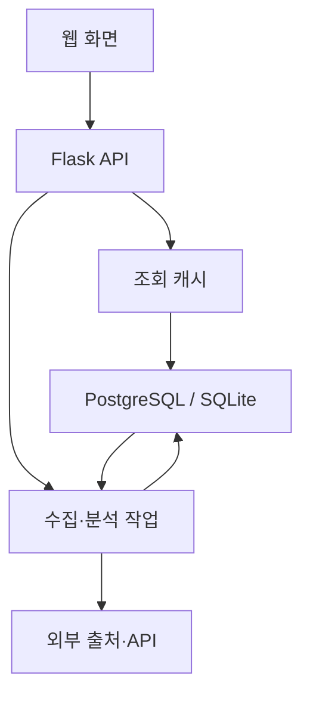

# 개발자노트 — 휴 스코프

현재 기준: **v3.70 · build 261004 · 2026-10-04**

휴 스코프는 김상화가 생활과 업무에 필요한 정보를 모아 쓰기 위해 제작·개선하는 개인 서비스다. 이 문서는 **현재 구현된 기능과 운영 방식**을 설명한다. 변경 당시의 내용과 적용 순서는 `CHANGELOG.md`에 보존한다.

## 1. 이번 이력 정비의 기준

- 운영 브랜치 `claude/quirky-euler-agfmp`의 실제 커밋, 현재 화면·API·저장 로직을 대조했다. 과거 대화의 요청만 있고 코드에 없는 기능은 완료로 기록하지 않았다.
- v3.58 이후 버전 표기 없이 배포된 변경을 적용 순서에 따라 **v3.59~v3.64**로 복원했다. 이 번호는 이번 정비에서 부여한 이력 번호이며, 당시 화면에 각각 표시되었던 버전은 아니다.
- 동일한 다운로드 진행 UI를 나누어 수정한 세 커밋은 v3.60 하나로 묶었다. 같은 변경을 세 번의 기능 출시로 기록하지 않았다.
- **v3.65**는 누락 이력 복원, 개발자노트 재작성, 관련 안내 정비와 버전 표기 통일이다. 기본 탭·위치·추천 호출 방식처럼 바뀐 내용은 본문을 최신 상태로 교체했다.
- v3.57의 버튼 내부 다운로드 로딩은 당시 구현이다. 현재는 v3.60에서 적용한 **작은 원형 스피너와 독립된 진행 텍스트**가 기준이다.
- v3.39의 개발자집 표시 예외는 당시 구현이다. 현재는 v3.64에서 **기본 위치 목록에서 제거**했다.

### v3.58 이후 복원한 변경

- **v3.58 / 행사 안내 문구**: 정보 오류 가능성·공식 일정 변경·참여 전 원문 확인을 한 문장으로 표시.
- **v3.59 / 검증된 곳 필터**: GPS 검색과 리뷰가 없는 지역에서도 필터를 유지하고 빈 결과를 안내.
- **v3.60 / 다운로드 진행 표시**: 버튼 대신 작은 원형 스피너와 다운로드 진행 텍스트를 표시.
- **v3.61 / 주소로 위치 지정**: 주소·장소 검색 결과에서 위치를 직접 선택해 주변 맛집 조회.
- **v3.62 / 최근 위치 목록**: GPS·주소 지정 기록을 최근 사용 순으로 저장하고 X로 개별 삭제.
- **v3.63 / 내 위치 주소 자동 표시**: GPS 좌표를 도로명·지번 주소로 변환하고 기존 기록도 보완.
- **v3.64 / 기본 위치 정리**: 개발자집 항목과 이전 브라우저 목록의 잔여 항목 제거.

## 2. 서비스 구성과 배포

- **웹 서버**: Python Flask + Gunicorn. 화면·조회 API·수집 작업·분석 작업을 같은 앱에서 제공한다.
- **호스팅**: Render의 hscope 웹 서비스. GitHub 운영 브랜치 변경을 자동 배포한다. 커밋 반영과 운영 응답 확인을 구분한다.
- **영구 저장소**: `DATABASE_URL`이 설정되면 외부 PostgreSQL을 사용한다. 미설정 시 SQLite로 동작하며 Render의 임시 파일시스템에서는 재배포 후 보존을 보장하지 않는다.
- **외부 연동**: Google News RSS, 기관 게시판 API, YouTube Data API, 행사 공공 API·공식 일정 페이지, Kakao Local, Anthropic, ECOS, Open DART, 국세청 사업자 상태조회.
- **개발 도구**: GitHub·Render MCP는 코드 확인·반영·배포 운영을 돕는 개발 도구다. 서비스 이용자의 요청을 처리하는 런타임 API와 구분한다.
- **서비스 주소**: https://hscope.onrender.com/
- **소개 페이지**: https://hscope.onrender.com/intro
- **저장소**: https://github.com/kksh0379/ncfoundation-collector
- **서체**: KoddiUD 온고딕을 직접 호스팅한다. 소개 페이지에 한국장애인개발원·CC BY-SA 출처를 표시한다.

### 데이터 흐름

조회는 저장된 정보를 우선 읽는다. 수집은 외부 출처를 읽어 저장하고, 분석은 저장된 후보·기사와 근거를 사용한다. 재무세무의 일부 조회 결과와 브라우저 설정은 별도 캐시에 보관한다.

## 3. 화면 구조와 디자인 기준

- **하단 메뉴**: 뉴스 / 맛집 / 재무세무 beta / 리포트 / 스크랩. 리포트와 스크랩은 모달로 열고, 다른 세 메뉴는 본문 화면을 전환한다.
- **뉴스 상단 6개 탭**: 냥정보 / 게임정보 / NC 뉴스 / 비영리재단 동향 / 보안뉴스 / 행사일정.
- **비영리재단 동향**: 동향 뉴스·재단 게시판·재단 유튜브를 날짜순으로 병합한다. 동향 / 게시판 / 영상 필터로 출처를 선택한다. 별도 게시판·유튜브 탭은 사용하지 않는다.
- **상단 탭 배치**: 버튼은 이름 길이에 맞추고 가용 폭에 따라 자연스럽게 줄바꿈한다. 3개씩 묶은 고정 행이나 가로 스크롤을 기준으로 하지 않는다.
- **공통 표현**: 분야별 색상과 선 SVG 아이콘, 문구 길이에 맞는 버튼, 자연스러운 한글 줄바꿈을 사용한다. 로딩은 작업 영역에 맞춰 표시한다.
- **썸네일**: 뉴스·동향·행사 카드와 큐레이션의 이미지 누락/로딩 실패는 `static/no-image.svg` 공통 디자인으로 표시한다. `newsThumb()`로 영역을 만들고 `thumbnailFallback()`으로 실패를 전환한다. 카드 크기·비율을 유지하며 리스트 보기의 이미지 숨김 정책은 그대로다. 모바일 큐레이션은 노이미지 영역 아래에 제목·일정을 표시한다.
- **넓은 화면의 이미지 배치**: 768px 이상 카드 보기의 비영리재단 동향은 뉴스·게시판·영상 모두 왼쪽 썸네일/오른쪽 본문으로 정렬한다. AI 큐레이션은 820px 제한 없이 콘텐츠 가용 폭을 사용하고 왼쪽 220~280px 이미지 열과 오른쪽 정보 열을 배치한다. 공통 노이미지도 같은 영역을 사용한다.
- **맛집 액션**: 평점·후기 / 상세보기 / 링크 복사를 한 줄로 정렬한다. 외부 상세 정보는 지도 서비스로 이동한다.
- **신규 표시와 개수**: 오늘 글이 없으면 해당 탭의 가장 최근 일자에 N 배지를 표시한다. 뉴스 게시물 수는 관리자에게 표시한다.
- **소개 화면**: 현재 기능·제작 목적·AI 활용 구조를 설명한다. 화면 캡처의 촬영 버전은 실제 촬영 시점을 유지하며 현재 배포 버전으로 바꿔 적지 않는다.

원문 뉴스 이미지는 `extract_image(soup, url)`에서 대표 메타 → 기사 JSON-LD → 본문 사진 순서로 찾는다. 상대경로는 최종 기사 URL을 기준으로 변환하고 지연 로딩 속성도 읽는다. HTTP 원본을 임의로 HTTPS로 바꾸지 않고 동향뉴스 화면의 `/api/img` 프록시로 표시한다.

**초기화·대량 재수집의 이미지 처리**: 대량 수집도 최신 150건은 원문과 사진을 먼저 조회하며 나머지는 RSS로 저장한 뒤 보강한다. 보강 후보는 섹션별 `published_at DESC, id DESC` 순서로 선택하고, 성공/실패 모두 `news.enrich_checked_at`에 확인 시각을 기록한다. 실패한 원문은 24시간 후 재시도한다. 이전 ID 커서는 사용하지 않으며 초기화 시 확인 시각도 기사 행과 함께 제거되어 새 기사에 영향이 없다. 잠금은 섹션별로 독립돼 다른 뉴스 탭 때문에 동향 보강이 생략되지 않는다.

동향 이미지 보강은 서버 시작 시와 **2분 주기**에 후보 최대 40건을 이어 처리한다(실제 후보 상한은 `IMG_ENRICH_MAX` 이내). 일반 수집 직후 보강은 최대 `IMG_ENRICH_MAX`건이다. 각 작업은 20건씩 저장·캐시 무효화를 수행하므로 확보한 사진부터 화면에 반영한다. 동향 작업이 겹치면 다음 정기 작업에서 미처리 후보를 다시 선택한다. 접근 불가·삭제된 원문은 노이미지로 남을 수 있으며 전체 복원이 보장되는 것은 아니다.

**통합 동향의 수집·초기화(v3.70)**: 동향·게시판·영상은 개별 수집 버튼·진행 메시지·마지막 수집 시각을 갖는다. 초기화 대상에서 ‘동향 전체’ 또는 세 출처 중 하나를 선택한다. 동향 전체는 `biz-all`로 요청하며 서버가 `biz / boards / social` 세 작업으로 분리한다. 시작 응답을 확인한 뒤 폴링하고 성공한 출처의 필터를 켜서 수집된 항목을 볼 수 있게 한다.

초기화·재수집은 삭제를 먼저 실행하지 않는다. 새 수집이 비었거나 실패하면 기존 자료를 보존한다. 일부 출처만 확보되면 기존 자료를 유지하며 확보한 항목만 갱신하고 ‘일부 수집’으로 표시한다. 완전한 응답은 해당 출처를 한 DB 트랜잭션에서 교체하며 저장 실패 시 롤백한다. 다른 출처·뉴스 섹션은 교체 대상이 아니다. 동일 URL의 기존 이미지·원문 주소는 새 응답에서 빠져도 보존한다.

Google RSS는 XML 요청 헤더로 읽고 RSS 형식을 검증한다. 모든 요청 실패를 정상 0건으로 처리하지 않으며 일부 요청 실패는 경고로 전달한다. 동향이 이미 빈 경우 서버가 최근 30일 복구 수집을 시도하며, 반복 실행은 한 시간 이상 간격으로 제한한다. 이는 과거 5년 전체 복원 완료를 의미하지 않는다. 공개 `newscheck`의 이미지 진단은 전체/이미지/확인 건수와 작업 실행 여부만 제공한다.

## 4. 계정·권한·개인화

- **방문자**: 공개 뉴스·행사·맛집·재무세무를 조회한다. 노출 여부는 관리자 표시 설정에 따른다.
- **로그인 사용자**: 스크랩·읽음·그룹, 맛집 평점·후기·방문 기록을 사용한다. 서버에는 계정 식별자로 저장하므로 같은 계정의 다른 기기에서도 개인 기록을 조회할 수 있다.
- **관리자**: 수집·초기화·표시 설정·진단·개발노트·수집/접속 로그와 리포트 생성을 관리한다.
- **표시 이름**: `admin`은 관리자, `test1` 및 로그인 별칭 `tester1`은 김테스터로 표시한다. 화면 이름과 저장용 계정 식별자를 구분한다.
- **리포트**: 생성·삭제는 관리자 API가 담당한다. 저장된 리포트의 공개 조회 API와 화면 노출 설정은 별도다. 방문자에게 리포트가 보이지 않는다는 설명을 서버 권한 보장으로 해석하지 않는다.
- **표시 설정**: `meta.feature_flags`로 공통 노출 설정을 저장한다. 관리자는 숨긴 기능도 관리 목적으로 볼 수 있다.
- **브라우저 저장**: 보기 방식·행사 관심사·맛집 최근 위치는 localStorage 설정이다. 계정별 서버 데이터와 달리 다른 브라우저나 기기에 자동 동기화되지 않는다.

## 5. 뉴스·동향 수집과 본문 읽기

- 뉴스는 Google News RSS를 기간별로 조회하고 제목·발행일·출처·요약·원문 링크·대표 이미지를 정규화한다. 초기 뉴스 조회는 최근 3개월을 우선 사용하고 전체 검색이 필요하면 누적 데이터를 가져온다.
- 저장 키는 수집 URL이다. 기사 원문 주소는 별도 필드로 복원하며, 제목·본문 유사도로 같은 보도를 묶는다. 여러 매체의 보도 건수는 실제 활동 건수와 같지 않다.
- 게시판은 대표홈페이지·프로젝토리·나의AAC·FAIR AI의 내부 목록 API로 수집한다. SPA라 수집하지 못한다는 초기 설명은 현재 구현과 다르다.
- 유튜브는 키가 있으면 Data API를 사용하고, NC문화재단 채널은 키가 없으면 RSS 최신분으로 대체한다. 주요 재단 영상은 키워드 검색이므로 공식 채널 여부를 확인해야 한다. 인스타그램 수집은 현재 구성에서 제외했다.
- **본문 읽기**: `collector/reader.py`가 등록된 원문을 서버에서 가져와 기사 문단을 추출한다. 추출 실패 시 수집된 요약과 원문 링크를 제공한다. 원문의 모든 광고나 모든 사이트의 본문 추출을 보장하지 않는다.
- **AI 핵심 요약**: 본문 읽기 화면에서 기사 내용에 근거한 요약·강조를 제공한다. 읽기 기능은 수집 배치와 별도다.
- **선택적 JS 대체 추출**: `READER_JS_FALLBACK=1`이면 JS 본문용 외부 리더를 사용할 수 있다. 기본은 꺼짐이며 공개 페이지 URL이 외부 서비스로 전달된다.

## 6. 행사일정·AI 큐레이션

### 출처와 정규화

- **뉴스**: 국내 행사를 검색하고 기사 작성일을 기준으로 날짜를 해석한다. 날짜가 확인되지 않거나 종료된 행사·해외 행사로 판별된 결과는 제외한다.
- **공공 API**: 한국관광공사 TourAPI와 한국문화정보원 문화정보를 병합한다. 문화정보는 `CULTURE_API_URL`을 실제 사용 중인 API 주소로 설정한다. 순수 공연류는 행사 수집 대상에서 제외한다.
- **공식 일정**: 코엑스·킨텍스·벡스코·대전컨벤션센터·aT센터·수원메쎄·세텍에서 기사 없는 행사도 수집한다. 코엑스는 기본 월간 목록, 새 6개 행사장은 향후 6개월 범위를 읽는다.
- 제목·시작일을 기준으로 중복을 정리하고 출처·기간·장소·이미지·원문 링크를 보존한다. 출처 하나가 실패해도 나머지 결과는 유지한다.
- 새 공식 출처는 배포 초기 백그라운드 수집 후 기존 정기 행사 수집에 통합한다. 초기 수집 여부·출처별 상태는 DB 메타데이터에 저장한다.
- 화면 안내는 **“뉴스에 소개된 행사 정보는 오류가 있거나 공식 일정이 변경될 수 있으니, 참여 전 원문을 확인해 주세요.”**로 표시한다.

### 탐색과 추천

- **일반 일정 / AI 큐레이션**을 분리하고 AI 큐레이션을 기본 화면으로 사용한다. 일반 일정은 리스트 / 앨범 / 캘린더를 지원한다.
- 일반 일정 보기 설정 `eventScheduleView`는 뉴스 보기 `nvView`와 독립이다. 캘린더 아래 선택일 목록은 공통 앨범 카드로 표시한다.
- 분야는 IT·기술 / AI·데이터 / AI 윤리 / 산업·비즈니스 / 문화·전시 / 교육·공익 / 반려동물 / 기타다. 여러 분야에 해당할 수 있으며 선택한 분야의 합집합을 조회한다.
- 초기 진입·탭 이동·검색·관심사 적용은 수집된 목록의 로컬 추천을 사용한다. **AI API는 [AI 추천받기] → 관심사 설정 → [설정하고 추천받기]로 확인할 때 호출**한다.
- AI는 저장된 후보 ID만 선택한다. 기간·장소·이미지를 새로 만들어 덮어쓰지 않는다. 실패·키 미설정 시 수집 정보 기반 추천임을 표시한다.
- AI 추천 작업은 동일 관심사 10분 캐시와 동시 작업 제한을 사용한다. 대기 중 기존 배너를 유지하고 중복 클릭을 막는다. 잔액 부족은 일반 연결 오류와 구분한다.
- 큐레이션은 제목·기간·장소를 배너에 한 번 표시하고 클릭으로 원문을 연다. 데스크톱은 썸네일과 정보 영역을 가로 배치하고 모바일은 이미지 배너를 사용한다.
- 캘린더는 날짜별 건수·선택일 목록·주간 날짜띠·월 이동·오늘 이동을 지원한다. 여러 날의 행사는 표시 날짜와 개최 기간의 교집합으로 집계한다.

## 7. 맛집: 위치 선택·조회·다운로드

### 세 가지 위치 선택

- **기본 위치 3곳**: NC문화재단 사옥 / NC 판교R&D센터 / 프로젝토리 성남지점. 사용자 화면에는 주소를 표시한다. 개발자집은 초기 설정과 공개 위치 목록, 이전 브라우저 목록에서 제거했다.
- **내 위치**: 브라우저 위치 권한을 받아 GPS 좌표로 조회한다. 위치 확인 거절·시간 초과·실패를 구분해서 안내한다. 500m / 1km / 2km 반경과 위치 재확인을 지원한다.
- **주소로 위치 지정**: 주소·장소명을 2~100자로 검색해 결과에서 선택한다. Kakao 주소 검색 결과가 없으면 장소 키워드 검색으로 보완하며 최대 8개 결과를 제공한다. 선택 좌표를 같은 주변 조회·다운로드 흐름에 전달한다.
- GPS와 주소 지정의 서버 요청은 `lat`·`lng`·`radius`를 사용한다. 서버는 유한한 국내 좌표 범위와 허용 반경을 검증한다. `id="gps"`는 이동형 검색을 뜻하며 주소 지정도 이 경로를 재사용한다.

### 최근 위치와 주소 표시

- GPS 확인과 주소 선택이 성공하면 **최근 위치**에 자동 추가하고 최근 사용 순으로 정렬한다. 같은 출처·좌표는 중복을 줄이고 다시 사용하면 맨 위로 이동한다. 최대 20개를 보관한다.
- 저장값은 출처·이름·주소·좌표·반경·사용 시각이다. 키는 `hscope-recent-locations-v1`이며 같은 브라우저에 저장한다. 최근 기록 선택은 저장 좌표를 사용하므로 GPS 권한을 다시 요청하지 않는다.
- **X 삭제**는 해당 브라우저의 최근 위치 기록을 지운다. 현재 조회 화면·공유 식당 DB·리뷰·방문 기록을 삭제하는 기능과 구분한다.
- **주소 자동 변환**: GPS 성공 직후 `/api/lunch/address/reverse`를 호출한다. Kakao `coord2address`의 도로명 주소를 우선 사용하고 없으면 지번 주소를 표시한다.
- 주소가 없는 기존 GPS 기록도 맛집 화면을 열면 순차 확인한다. 확인 중·확인 실패 상태를 표시하고, 이후 다시 조회할 수 있다. 주소 지정 결과와 이미 확인된 주소는 추가 변환하지 않는다.
- 같은 좌표의 주소 요청은 중복을 억제한다. 늦은 응답이 다른 선택 위치의 주소를 바꾸거나, X로 지운 기록을 다시 추가하지 않도록 현재 좌표와 남아 있는 기록을 비교한다. 주소 보완 시 사용 시각과 목록 순서는 유지한다.

### 기존 데이터 보존과 신규 다운로드

- 위치 선택 후 **저장된 주변 식당을 먼저 조회**한다. 전체 위치에 저장된 좌표를 거리로 비교하므로 다른 기본 위치에 속한 기존 식당도 재사용한다.
- 다운로드 범위가 아직 확보되지 않았다면 **사용자 확인 후** Kakao 수집을 시작한다. 서버는 `confirmed=true`를 검증한다. 화면 진입이나 주소 변환만으로 식당 다운로드를 시작하지 않는다.
- 주변 다운로드는 **신규 삽입만** 수행한다. 같은 제공자의 장소 ID를 우선 비교하고, 수동·이관 기록은 이름·일치 주소·35m 이내 좌표를 함께 확인한다. 이름만 같은 다른 식당은 합치지 않는다.
- 기존 식당 ID·상호·주소·분류·제외 상태와 리뷰·방문 기록을 갱신하지 않는다. 기존 식당은 저장된 정보를 다시 불러온다. GPS 신규 식당은 `loc_id=0`에 저장한다.
- 신규 식당과 다운로드 영역 `lunch_download_area`를 같은 트랜잭션에 기록한다. API 실패 때 확보 범위를 완료로 저장하지 않는다. 이미 확보한 범위는 다시 내려받지 않는다.
- 다운로드는 서버 백그라운드 작업과 상태 폴링으로 처리한다. 진행 중에는 **버튼 UI 대신 작은 원형 스피너 + 진행 텍스트**를 표시한다. 완료·실패 후 필요한 버튼 상태로 복구한다.
- **검증된 곳**은 앱에 리뷰가 있는 식당을 거르는 필터다. 외부 인증·위생 검증을 뜻하지 않는다. GPS·주소 위치에도 표시하며 리뷰 식당이 없으면 빈 결과 안내를 제공한다.
- 기본 위치의 관리자 수집·주간 갱신은 기존 `lunch_upsert_restaurants`를 사용한다. **신규 삽입만 적용하는 정책은 주변 다운로드 경로의 정책**이다.

### 리뷰·방문·점심 추천

- 로그인 사용자만 별점·후기·방문을 기록한다. 식당 상세는 지도 링크로 이동한다. 메뉴·가격·영업시간·외부 평점은 보유하지 않는 정보를 만들어 표시하지 않는다.
- 점심 추천은 이름에 AI가 포함되어 있어도 **현재 서버 구현은 점수 기반 규칙 엔진**이다. `_lunch_score`로 정렬한 상위 5곳에서 가중 랜덤으로 선택하며 Anthropic API를 호출하지 않는다.
- 성향·기분·회피 음식 종류·거리·평점·최근 방문/카테고리 등을 고려한다. 후보는 실제 현재 목록에서 가져오며 GPS·주소 위치도 지원한다.
- 프론트는 서버 추천 실패·오류·5초 지연 시 같은 목록에서 조건을 유지한 대체 추천을 사용한다. 추천 응답도 사용 가능한 후보인지 확인한다.
- 기본 위치 수집은 관리자 수동 실행 및 `LUNCH_REFRESH_DAYS` 주기 갱신을 지원한다. 기본 주기는 7일이며 폐업 여부를 추정해 자동 삭제하지 않는다.

## 8. 보안 분석·리포트

- **보안뉴스 AI 후처리**: 수집 후 미분석 기사를 대상으로 Claude 배치 분석을 실행한다. 태그·중요도·시사점과 근거가 있는 기관·CVE·피해·조치 정보를 저장한다. 키가 없으면 뉴스 수집은 유지하고 AI 분석을 건너뛴다.
- **재단 동향 리포트**: 공개 뉴스·게시판이 화면에서 통합되더라도 분석 입력은 해당 분석 모듈의 뉴스·영상 정리 규칙에 따른다. 중복 보도 정리 후 변화·추세·신호·벤치마크·검토 과제와 근거를 저장한다.
- **월간 보안 리포트**: 지난달 보안뉴스를 요약·사고·취약점·규제기관 처분·대응 권고로 정리한다. 공식 의결서·기술적 원인은 원문 확인 대상으로 남긴다.
- 리포트는 `report_snapshot`에 저장한다. 같은 날·같은 기간의 재단 리포트는 교체하고 다른 시점은 비교용으로 보존한다. 보안 리포트는 월 키를 사용한다.
- 생성·삭제는 관리자, 목록·열람은 조회 API가 담당한다. 월간 보안 자동 생성은 이전 달 스냅샷이 없을 때만 수행하며 `SECREPORT_AUTO=0`으로 끌 수 있다.
- 실제 Claude API를 사용하는 기능과 맛집 규칙 추천을 구분해 비용·실패 경로를 설명한다.

## 9. 재무세무 beta

- **화면**: 지표 / 계산기 / 세무·공시 / 브리핑. 뉴스 화면과 독립된 `collector/finance.py` Blueprint를 사용한다.
- **지표**: ECOS 발표값과 엔씨 일별 주가를 구분한다. 최신 발표일·직전 관측 대비 증감·추이를 표시한다. 실시간 시세라고 설명하지 않는다.
- **계산기**: 연봉 실수령액 근사·예적금 이자·대출 원리금을 브라우저 룰셋으로 계산한다. 적용 연도·요율과 한계는 해당 화면·`FINANCE.md`에 따른다.
- **세무·공시**: 국세 법정기한 룰셋, 국세청 사업자 상태조회, Open DART 공시를 제공한다. DART는 종목코드·고유번호를 사용하며 사업자번호로 조회하지 않는다.
- **브리핑**: 공식 RSS 또는 Google News RSS를 출처별로 정규화한다. 본문 읽기·로그인 스크랩·읽음·링크 복사를 연결한다.
- 대시보드 15분 / 공시 5분 / 주가 60초 프로세스 캐시를 사용한다. 브리핑은 실패 시 최근 성공분을 최대 6시간 유지한다. 영구 기사 보관·백그라운드 정기 수집과 구분한다.
- API 키는 서버에 보관하고 사업자번호는 앱 로그·DB에 저장하지 않는다. 미설정·실패·빈 결과를 구분하며 일부 실패 시 다른 위젯을 유지한다.
- 연동 설정·데이터 정책·산식 설명의 상세 문서는 `FINANCE.md`다.

## 10. 조회 성능·작업 운영

- `collector/read_cache.py`의 공용 조회 캐시는 프로세스별 32키·동시 갱신 6개를 기본으로 사용한다. 실패 후 재시도 간격은 기본 1.5초다. 최근 정상 결과를 갱신 중에도 제공하고 실패 후 짧게 재시도를 억제한다.
- 맛집 위치는 별도 1키·1작업 캐시로 분리해 뉴스 조회와 경쟁을 줄인다. 위치 TTL 300초, 고정 위치 식당 TTL 30초, 일반 공개 조회·메타·리포트는 45초 기준이다.
- 사용자 스크랩·읽음·그룹을 공용 캐시에 넣지 않는다. 위치 브라우저 캐시는 선택 화면을 먼저 표시한 뒤 서버 결과로 갱신한다.
- 결과 준비 중이면 일반 목록은 `X-Data-Pending: 1`, 위치 목록은 `db_waking`을 사용한다. 프론트는 제한된 재조회로 빈 결과와 준비 중을 구분한다.
- 공용 목록은 백그라운드 캐시 결과를 최대 3초 기다린다. 요청 문맥에서 필요한 인자를 먼저 읽어 워커가 Flask request를 직접 참조하지 않도록 한다.
- 수집·변경 후 관련 캐시를 무효화한다. 진행 중이던 예전 쿼리가 무효화된 캐시를 다시 채우지 않도록 세대 상태를 확인한다.
- `Server-Timing: app;dur=...`는 요청 처리 시간을 표시한다. 네트워크나 DB 쿼리 시간만을 뜻하지 않는다.
- 내부 스케줄러는 기본 4시간 주기로 배치를 실행한다. 외부 `/api/cron`은 토큰으로 인증한다. 최초 백필은 기본 꺼짐이다.
- Gunicorn fork 전에 수집 스레드를 시작하지 않고 워커의 첫 요청 이후 작업·읽기 준비를 시작한다. 프로세스 내 캐시·작업 상태는 재시작 시 사라질 수 있다.
- 여러 워커·인스턴스로 확장하면 캐시와 작업 상태를 공유하는 별도 설계가 필요하다. 현재의 프로세스 내 구조를 분산 작업 큐로 설명하지 않는다.

## 11. 설정 항목

값은 Render 환경변수 또는 로컬 프로세스 환경에서 주입한다. 이 문서에 실제 비밀번호·키·연결 문자열을 기록하지 않는다.

- **기본**: `DATABASE_URL`, `ADMIN_PW`, `SECRET_KEY`, `CRON_TOKEN`.
- **수집**: `YOUTUBE_API_KEY`, `TOURAPI_KEY`, `CULTURE_API_KEY`, `CULTURE_API_URL`. 행사장 설정은 `EVENTS.md` 참고.
- **맛집**: `KAKAO_REST_KEY` 하나로 주소 검색·장소 검색·GPS 주소 변환·식당 수집을 사용한다. 별도 브라우저 키나 지도 JS SDK는 필요하지 않다. `LUNCH_REFRESH_DAYS` 기본 7, 0이면 자동 갱신을 끈다.
- **AI**: `ANTHROPIC_API_KEY`, `ANALYSIS_MODEL`, `EVENT_CURATION_MODEL`. 모델 자동 선택·작업별 설정은 각 분석 모듈을 기준으로 한다. 맛집 점수 추천에는 이 키가 필요하지 않다.
- **보안 분석**: `SEC_AI_LIMIT`, `SEC_AI_BATCH`, `SEC_AI_MAX_TOKENS`, `SEC_AI_CRAWL_MAX`, `SECREPORT_MAX_TOKENS`, `SECREPORT_ARTICLES`, `SECREPORT_AUTO`.
- **배치·성능**: `ENABLE_SCHEDULER`, `ENABLE_DB_PREWARM`, `AUTO_BACKFILL`, `BACKFILL_DAYS`, `BATCH_DAYS`, `DB_KEEPALIVE_SEC`, `IMG_ENRICH_MAX`, `EVENT_BODY_MAX`. keepalive는 DB 요금제에 맞춰 설정한다.
- **재무세무**: `ECOS_API_KEY`, `NTS_API_KEY`, `DART_API_KEY`, `NC_STOCK_CODE`, `NC_STOCK_NAME`, `NC_STOCK_URL`, `FINANCE_RSS_*`. 상세는 `FINANCE.md` 참고.
- **리더**: `READER_JS_FALLBACK`은 선택적 외부 본문 추출이다.

## 12. 확인·진단·남은 과제

- **서비스 확인**: `/healthz`, 화면의 버전 표기, 실제 정적 파일과 관련 조회 응답을 함께 확인한다. GitHub 커밋 성공만으로 배포 완료로 판단하지 않는다.
- **조회 진단**: `/api/dbcheck`, `/api/newscheck`, `/api/eventcheck`, `/api/finance/ecoscheck`. 관리자 수집 진단은 `/api/diag`, `/api/lunch/diag`.
- **주소 확인**: 주소 검색·역변환 키 미설정/실패 시 오류를 안내한다. 주소 확인 실패가 저장된 식당 조회를 막지 않도록 별도 처리한다.
- **다운로드 상태**: 주변 다운로드 상태는 요청 세션의 작업 소유자를 확인한다. 재시작으로 작업 상태가 사라졌다면 주변 목록을 다시 조회한다.
- **최근 위치 범위**: 브라우저 기록 삭제와 식당 데이터 초기화를 혼동하지 않는다. 관리자 위치 초기화는 해당 식당·리뷰·방문 데이터를 삭제한다.
- **데이터 보존**: `DATABASE_URL` 제거·DB 프로젝트 삭제·관리자 초기화를 일반적인 목록 정리 수단으로 사용하지 않는다.
- **공개 전 기존 과제**: 테스트 계정과 로그인 힌트를 정리하고, 임의 URL을 요청하는 공개 진단/이미지 경로의 접근·대상 제한을 검토한다. 이 문서 정비에서 보안 조치까지 완료했다고 기록하지 않는다.
- **검증 범위**: 문서 정비에는 실제 코드·커밋 대조, 패치내역 렌더링 회귀 검사, 템플릿 버전·문서 일관성 확인을 사용한다. 실제 GPS 권한은 이용 기기의 브라우저에서 확인해야 한다.

## 13. 코드 맵과 기록 관리

- `app.py`: Flask 화면·API, 계정·표시 설정, 조회 캐시, 수집/분석 작업, 위치·주변 다운로드, 스케줄러·크론.
- `collector/db.py`: PostgreSQL/SQLite, 뉴스·행사·개인화·리포트·맛집 저장, 주변 다운로드 중복 비교와 범위 저장.
- `collector/google_news.py`, `boards.py`, `social.py`: 뉴스·기관 게시판·유튜브 출처 수집.
- `collector/events.py`, `event_sources.py`, `venue_sources.py`, `event_curation.py`: 행사 정규화·공공/공식 출처·AI 큐레이션.
- `collector/lunch.py`: Kakao Local 주소 검색·GPS 주소 변환·좌표·식당 수집·거리·분류.
- `collector/analysis.py`, `security_ai.py`, `security_report.py`: 재단 분석·보안 태깅·월간 보안 리포트.
- `collector/reader.py`, `collector/finance.py`, `collector/read_cache.py`: 본문 읽기·재무세무·조회 캐시.
- `templates/index.html`, `static/js/app.js`, `static/css/style.css`: 공통 화면·맛집·버전 표기. 행사·리더·재무세무는 각 전용 JS/CSS와 연결한다.
- `templates/intro.html`, `static/intro/`: 서비스 소개와 촬영 화면.
- `DEVNOTE.md`: 현재 기능·구조·운영 설명. `CHANGELOG.md`: 버전별 변경 당시 이력. `EVENTS.md`, `FINANCE.md`: 출처·연동 세부 문서.
- 다음 기능 변경은 **코드·버전·패치내역·개발자노트의 관련 절을 같은 커밋에서 갱신**한다. 소개 페이지 버전도 함께 맞추되 캡처 촬영 버전은 보존한다. 배포 뒤 운영 화면으로 확인한다.

